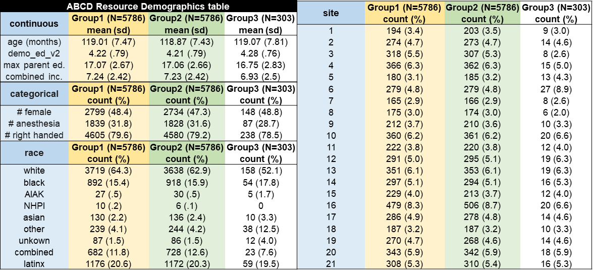

## <i class="fa-solid fa-brain icon-heading"></i> Introduction

The **ABCD-BIDS Community Collection (ABCC)** provides processed, analysis-ready neuroimaging derivatives from the ABCD Study, updated alongside central ABCD data releases. The collection leverages state-of-the-art, community-standard pipelines, including fMRIPrep, XCP-D, and QSIPrep/QSIRecon, to generate harmonized structural, functional, and diffusion MRI derivatives, along with downstream outputs for connectivity and advanced analyses.

::: {.callout-note collapse="true" title="Historical Context"}
ABCC was originally released as an independent resource on the NIMH Data Archive ([NDA Collection 3165](https://nda-abcd-collection-3165.readthedocs.io/latest/)) to provide curated derivatives generated by community-developed neuroimaging pipelines and analytical tools. Its goals were to improve reproducibility, methodological standardization, and reduce barriers introduced by the enormous size of the data (e.g., computing resources required for processing) in support of child and adolescent mental health research [@feczko2021]. 

ABCC has been tremendously successful, and was originally developed by ABCD investigators and staff, so has since been incorporated into official ABCD Study data releases. Although no longer distributed as a separate “community collection,” the name has been retained to preserve continuity with prior releases, documentation, and published literature. Future community collections will be accepted via the NBDC Data Hub (feature coming soon).
:::

::: {.callout-note collapse="true" title="High-Impact Studies Using ABCC Data"}
To date, ABCC has supported over 100 publications spanning brain development, cognition, mental health, and methodological innovation. A full list of publications and formatted citation files are available [here](https://drive.google.com/drive/folders/1OrN2IAAQIIgLVx_D_qmABoHuW_yqppZf?usp=sharing). Highlights include:

- **Meisler et al. ([2026](https://www.biorxiv.org/content/10.64898/2026.04.18.719321v1))**: Highly replicable multisite patterns of adolescent white matter maturation
- **@marek2019**: Identifying reproducible individual differences in childhood functional brain networks: An ABCD study (*Developmental Cognitive Neuroscience*)
- **@chaarani2021**: Task activation patterns in 9-10 year old youths 
- **@cieslak2021**: QSIPrep: an integrative platform for preprocessing and reconstructing diffusion MRI data (*Nature Methods*)
- **@bethlehem2022**: Brain Charts for the human lifespan
- **@marek2022**: Reproducible brain behavior associations require thousands of samples
- **@gordon2023**: Identification of the human SCAN network, revolutionizing our understanding of the human motor system.
- **@keller2023**: Functional topography is associated with youth cognition
- **@hermosillo2024**: Individualized functional network mapping in adolescents (*Nature Neuroscience*)
- **@keller2024**: Environmental exposures mediate the association between functional topography and cognition
- **@mehta2024**: XCP-D: an extensible pipeline for rs-fMRI connectivity preprocessing
:::

---

### Key Features

- Data are compliant with the Brain Imaging Data Structure ([BIDS](https://bids-specification.readthedocs.io/)) standard for reproducible, cross-study analyses.
- Data are processed using state-of-the-art, publicly available pipelines developed within the [NMIND](https://www.nmind.org/about) framework for reproducible neuroimaging software *([see details](#processing-analytic-standards))*.
- All ABCC release data have passed [DAIRC](https://abcdstudy.org/study-sites/daic/) raw MR data quality control (QC). In addition, QC is performed post-processing via [BrainSwipes](https://brainswipes.us/), a community-driven visual QC platform (*to be available in a future release*).
- Each release includes detailed version tracking and change logs.

---

### Processing & Data Standards

Processing pipelines used to generate the ABCC derivatives follow community standards for reproducible neuroimaging software laid out by the [NMIND](https://www.nmind.org/about) consortium [@kiar2023]. Pipelines must be publicly available, containerized, and published with a DOI. Pipelines are peer-reviewed via the [NMIND Coding Standards Checklist](https://www.nmind.org/standards-checklist/) to ensure they meet community-driven scientific software standards for documentation, infrastructure, and testability. This process assigns badge ratings to reviewed tools, which are published on the NMIND website under [Evaluated Tools](https://www.nmind.org/proceedings/). 

---

## <i class="fa-regular fa-note-sticky icon-heading"></i> Release Notes (v4.0.0)

::: {.callout-note title="Release Date: 2026-05-13"}
:::

### Core Data

The ABCC includes data processed through the following pipelines:

- **Structural & Functional MRI** [NEW]
    - [fMRIPrep v25.1.4](https://fmriprep.org/): Minimal functional pre-processing
    - [XCP-D v0.13.0](https://xcp-d.readthedocs.io/): Functional post-processing, including denoising & connectivity 
    - [ReproTM](https://github.com/KateJGodfrey/ReproTM): Individualized functional network maps via template matching
- **Diffusion MRI**
    - [QSIPrep](https://qsiprep.readthedocs.io/): Pre-processing 
    - [QSIRecon](https://qsirecon.readthedocs.io/): Reconstruction workflows
- **ModelArrayIO** [NEW]
    - <a href="https://modelarrayio.readthedocs.io/">ModelArrayIO</a> outputs (HDF/CSV) for efficient voxel- and/or vertex-wise statistical modeling with the [ModelArray R package](https://github.com/ModelArray/ModelArray), including:
        - QSIRecon-ModelArray multi-model diffusion metrics
        - XCP-D-ModelArray connectivity, ALFF, ReHo, and morphometrics 

::: {.callout-caution title="ABCD-HCP BIDS Pipeline Deprecation"}
ABCC no longer includes [ABCD-HCP BIDS](https://abcd-hcp-pipeline.readthedocs.io/) derivatives: *see [release notes](#abcd-hcp-pipeline-deprecation) for details*.
:::

::: {.callout-important title="NOTE: fMRIPrep Minimally Processed Derivatives"}
This minimal release excludes preprocessed BOLD timeseries, confounds, and surface-projected functional data. Users who require full outputs can follow the instructions provided under [How to Generate Full Derivatives](abcc_fmriprep.qmd#overview-processing).
:::

### Participant Counts

| Year     | fMRIPrep | XCP-D  | QSIPrep | ReproTM |
| -------- | -------- | ------ | ------- | ------- |
| Baseline | 11,685   | 10,396 | 9,163   | 6,035   |
| 2        | 8,043    | 7,654  | 7,276   | 5,767   |
| 4        | 6,303    | 6,147  | 6,063   | 5,380   |
| 6        | 3,797    | 3,756  | 3,675   | 3,492   |

::: {.callout-note collapse="true" title="Processing Success Rates"}
Available raw BIDS counts are shown below for each pipeline by study year. Differences reflect modality requirements (sMRI, sMRI+fMRI, or dMRI). Overall processing success rates were high across pipelines (96.6–99.8%).

| Year     | fMRIPrep | XCP-D  | QSIPrep |
| -------- | -------- | ------ | ------- |
|     | *sMRI present* | *sMRI+fMRI present*  | *dMRI present* |
| Baseline | 11,706   | 10,416 | 9,561   |
| 2        | 8,061    | 7,672  | 7,666   |
| 4        | 6,325    | 6,166  | 6,203   |
| 6        | 3,806    | 3,765  | 3,747   |
:::

### Demographically Matched Subsets

The `matched_group` field of the [participants.tsv](https://abcd-docs-private.lassoinformatics.com/data_documentation/imaging/6.0_imaging_abcc.html) file signifies each participant's assignment to one of the ABCD Reproducible Matched Samples (ARMS). In Release 2.0, ABCD data were split into 3 demographically matched groups: ARMS-1 (N=5,786) and ARMS-2 (N=5,786) for use as independent datasets, and ARMS-3 (N=305) for template building and model testing. These group assignments have been carried over into the current release, with the following updated counts: ARMS-1 (N=5,752), ARMS-2 (N=5,745), and ARMS-3 (N=301).

::: {.callout-note collapse="true" title="How Matched Groups Were Created"}
To create the matched ARMS, 9 salient sociodemographic factors were selected based on their relevance to developmental outcomes: site, age, sex, ethnicity, grade, highest level of parental education, handedness, combined family income, and exposure to anesthesia. Family structure was also accounted for [@marek2019]. Anesthesia exposure was included as a matching variable to account for differences in major medical interventions and their possible effects on behavioral and neurodevelopmental outcomes [@schneuer2018]. To maximize the relative independence of the two datasets, family members were kept together in the same ARM, and the groups were matched to have equivalent numbers of sibling and twin pairs, and triplets.

Comparison of the counts and means for each of these factors shows that ARMS-1 and ARMS-2 are negligibly and not statistically different samples. Gender shows the largest absolute difference of 2.5%; no other demographic variables differ by more than 1%. See @feczko2021 for a full description of how these matched groups were generated. The code used is available at: <https://github.com/DCAN-Labs/automated-subset-analysis>.

{width=100%}
:::

### Demographically Matched Subsets

The `matched_group` field of the [participants.tsv](https://abcd-docs-private.lassoinformatics.com/data_documentation/imaging/6.0_imaging_abcc.html) file signifies each participant's assignment to one of the ABCD Reproducible Matched Samples (ARMS). In Release 2.0, ABCD data were split into 3 demographically matched groups: ARMS-1 (N=5,786) and ARMS-2 (N=5,786) for use as independent datasets, and ARMS-3 (N=305) for template building and model testing. These group assignments have been carried over into the current release, with the following updated counts: ARMS-1 (N=5,752), ARMS-2 (N=5,745), and ARMS-3 (N=301).

::: {.callout-note collapse="true" title="How Matched Groups Were Created"}
To create the matched ARMS, 9 salient sociodemographic factors were selected based on their relevance to developmental outcomes: site, age, sex, ethnicity, grade, highest level of parental education, handedness, combined family income, and exposure to anesthesia. Family structure was also accounted for [@marek2019]. Anesthesia exposure was included as a matching variable to account for differences in major medical interventions and their possible effects on behavioral and neurodevelopmental outcomes [@schneuer2018]. To maximize the relative independence of the two datasets, family members were kept together in the same ARM, and the groups were matched to have equivalent numbers of sibling and twin pairs, and triplets.

Comparison of the counts and means for each of these factors shows that ARMS-1 and ARMS-2 are negligibly and not statistically different samples. Gender shows the largest absolute difference of 2.5%; no other demographic variables differ by more than 1%. See @feczko2021 for a full description of how these matched groups were generated. The code used is available at: <https://github.com/DCAN-Labs/automated-subset-analysis>.

{width=100%}
:::

### Key Revisions

Starting with Release 7.0, ABCC distributions include the following updates. Documentation for prior releases remains available via the **Version** dropdown menu located in the upper right-hand corner of the ABCD Data Documentation site.

#### Raw BIDS Consolidation 

In Releases 6.0–6.1, BIDS raw data were distributed separately under `dairc/` and `abcc/`. As of Release 7.0, all raw BIDS data are consolidated under a single `dairc/` collection.    
  *Legacy documentation: [Raw BIDS](https://docs.abcdstudy.org/v/6_1_3/documentation/imaging/abcc_inputs.html)*

#### ABCD-HCP Pipeline Deprecation

Beginning with Release 7.0, ABCD-HCP pipeline derivatives are no longer included in ABCC releases. Moving forward, ABCC will focus on fMRIPrep- and XCP-D–based derivatives for structural and functional MRI to align with current community standards. Legacy ABCD-HCP outputs remain available in Release 6.1 via the NBDC Data Hub, including:

 - **ABCD-HCP BIDS v0.1.4**: HCP-style MRI processing pipeline in volume & surface space
 - **FreeSurfer 5.3.0-HCP**: Segmentation statistics & surface morphometrics 

Associated documentation is available in the 6.1.3 legacy documentation: see [Processing](https://docs.abcdstudy.org/v/6_1_3/documentation/imaging/abcc_pipeline.html) and [Derivatives](https://docs.abcdstudy.org/v/6_1_3/documentation/imaging/abcc_derivatives.html).

### Known Issues

#### [1] Connectivity matrices from individual runs
Connectivity matrices generated using `--create-matrices 300 600 all` were incorrectly computed separately for each BOLD run rather than the concatenated low-motion timeseries across runs. As a result:
 
- For concatenated data, only the matrix generated from the full timeseries (`all`) is available
- Run-specific 300-frame matrices may be present for runs with a sufficient amount of low-motion data in addition to the matrix generated from `all`

The next release (processed through XCP-D v26.0.3 or later) will include the `300-` and `600-`frame matrices generated from concatenated low-motion timeseries across runs, and only a single matrix will be generated per run from all available low-motion frames.

#### [2] Timeseries not z-scored prior to concatenation

Timeseries data were not z-scored before concatenation. This issue will be addressed in a future release using XCP-D v26.0.3.

#### [3] Missing cases from duplicate run reprocessing

Four cases failed due to out-of-memory errors during reprocessing of duplicate functional runs and are excluded from this release. Derivatives for these cases remain available in prior releases. [(View affected cases)](https://abcd-docs-private.lassoinformatics.com/data_documentation/imaging/6.0_imaging_abcc.html)

---

## <i class="fa-solid fa-bullhorn icon-heading"></i> Coming Soon

- **Imaging derivatives for remaining subjects**: [fMRIPrep v25.1.4](https://fmriprep.org) minimal preprocessing outputs, along with confound estimates for all processed subjects, and [XCP-D v26.0.3](https://xcp-d.readthedocs.io) post-processing outputs
- **ReproTM** individualized functional network maps for all functional tasks ( MID, SST, nBack)
- **Task fMRI analysis results**
- **BrainSwipes Quality Control**: structural/functional QC of XCP-D outputs generated via BrainSwipes, a gamified crowdsourcing platform for high-volume manual QC 

::: {.callout-note title="BrainSwipes Quality Control Results"}
BrainSwipes is a community-driven effort and we encourage all ABCC users to participate! **No prior experience with visual QC is required.** To get started, create a free account on [BrainSwipes](https://brainswipes.us/). You will then be guided through a simple [tutorial](https://brainswipes.us/tutorial-select) that demonstrates how to evaluate derivative images and classify them as pass or fail.
:::

---

## <i class="fa-solid fa-history icon-heading"></i> Release History

| Version | Release Date |    Release Notes   |
|:-------|:------------|:------------------|
| **3.1.0**   |   2025-12-03 | [View Release Notes](https://docs.abcdstudy.org/v/6_1_3/documentation/imaging/abcc_start_page.html#release-notes-v310) |
| **3.0.0**   |   2025-06-26 | [View Release Notes](https://docs.abcdstudy.org/v/6_0_3/documentation/imaging/abcc_start_page.html#whats-in-release-3.0.0-2025-06-26) |

::: {.callout-note title="Release 1.0–2.0 Archive"}
ABCC releases 1.0 - 2.0 were distributed through the [NIMH Data Archive (NDA)](https://nda.nih.gov/). Starting with Release 3.0.0 (2025), ABCC data transitioned to the [NBDC Data Hub](https://www.nbdc-datahub.org/) and release notes no longer reflect NDA repository revisions. Release notes and documentation for NDA-based releases are available in the [ABCC Archival Data Release Documentation](https://nda-abcd-collection-3165.readthedocs.io).
:::

<!-- RELEASE 3.1.0 -->

<!-- ::: {.callout-note collapse="true" title="Release 3.1.0 (2025-12-03)"}
**NEW ADDITIONS**

1. **QSIRecon** reconstruction derivatives generated from preprocessed diffusion MRI data using the following reconstruction specifications:
    - **Diffusion tensor modeling**: DSI Studio (all b-values), TORTOISE (b < 1200), DIPY (as part of DKI)
    - **Diffusion kurtosis modeling**: DIPY
    - **Q-space imaging**: DSI Studio 
    - **NODDI models**: AMICO
    - **Tractography**: DSI Studio AutoTrack on MSMT FODs (from MRtrix3)

2. **QSIRecon-ModelArray** - A single HDF5 (.h5) file and corresponding CSV file containing Mean Diffusivity (MD) values from all subjects in the current QSIRecon output. These files enable efficient voxelwise model fitting in R using the **[ModelArray package](https://github.com/PennLINC/ModelArray)**, allowing users to compute and write model-fitted parameters, p-values, and R² maps back into NIfTI files.

**REVISIONS**

Resolved critical issues in abcd-hcp-pipeline derivatives:

1. **Missing Volume-Based Resting-State Data (Runs 3–8)**: Restored missing data by re-executing the file-mapper across all participants
2. **Missing nBack Filtered Concatenated dtseries**: Generated missing files using the using [abcc_concat_filtered_dtseries_generator tool](https://github.com/DCAN-Labs/abcc_concat_filtered_dtseries_generator) for all participants.
3. **Timepoint Mismatch Resolution**: Resolved timepoint mismatches between filtered dtseries ( `*_task-*_bold_desc-filtered_timeseries.dtseries.nii`)and motion mask files ( `*_task-*_desc-filtered_motion_mask.mat`)( N ~ 746 ) [(View affected cases)](https://abcd-docs-private.lassoinformatics.com/release_notes/imaging/6.0_imaging_abcc.html)
4. **Duplicate Functional Runs**: Reprocessed 861 cases through complete BIDS conversion and abcd-hcp-pipeline re-execution [(View affected cases)](https://abcd-docs-private.lassoinformatics.com/release_notes/imaging/6.0_imaging_abcc.html)

**KNOWN ISSUE**        
**Missing Cases from Duplicate Run Reprocessing**: During reprocessing of duplicate functional runs, four cases failed due to out-of-memory errors and are not included in the current release. Derivatives for these cases remain available in previous releases and can be accessed if needed. [(View affected cases)](https://abcd-docs-private.lassoinformatics.com/release_notes/imaging/6.0_imaging_abcc.html)
::: -->

<!-- RELEASE 3.0.0 -->

<!-- ::: {.callout-note collapse="true" title="Release 3.0.0 (2025-06-26)"}
**REVISIONS**

1. **Updated abcd-hcp-pipeline v0.1.4:**: Enhanced BIDS compliance, streamlined directory structure, updated ExecutiveSummary QC, and improved BOLD bandpass filtering. (see changes [here](https://github.com/DCAN-Labs/abcd-hcp-pipeline/releases/tag/v0.1.4)) 
1. **Fixed incorrect AP/PA labeling** in subset of GE dv26 subjects.
1. **Updated QSIPrep v0.21.4** (see changes [here](https://github.com/PennLINC/qsiprep/releases/tag/0.21.4)): Critical fixes to distortion correction and QC metric calculation.

**Important Note**: Users of earlier QSIPrep derivatives are encouraged to reprocess analyses to account for the distortion correction fix. In the prior release, TOPUP was given a denoised b=0 image from the DWI series and a raw b=0 image in the opposite phase encoding direction, resulting in inaccurate distortion correction for a subset of subjects. The updated version uses unprocessed b=0 images in both phase encoding directions.

**NEW ADDITIONS**

1. Additional inputs and derivatives for **Years 2, 4, and 6**
1. Expanded **QSIPrep** diffusion derivatives
1. New `sessions.tsv` files with session demographics, acquisition timestamps, scanner metadata, and automated QC metrics. Structural QA columns include BOLD brain coverage Pass/Fail indicators (`bc_(task)_run-(run_num)`) based on 10% threshold, coverage percentages (`bc_(task)_run-(run_num)_perc_vox`), and outlier counts for subcortical segmentation volumes (n=22) and cortical morphometry (n=333). Functional QA columns include Pass/Fail indicators for 5- and 10-minute connectivity matrix generation (`5min_pconn_<atlas>`, `10min_pconn_<atlas>`) and corresponding outlier counts (n=61776) across five parcellation schemes: Gordon2014, HCP2016, Markov2012, Power2011, and Yeo2011 (all with FreeSurferSubcortical). Values of 888 indicate missing or ungenerated files, except for pconn Pass/Fail columns.

**KNOWN ISSUE**     
**Missing Volume-Based Resting-State Run Files (Runs 3–8):** Due to a transfer issue, some minimally processed, volume-based resting-state data are missing for runs 3–8 (mainly affecting data from Years 4 and 6). **Surface-based CIFTI data — used by most researchers — are fully available and unaffected.** Affected files include:

    - `*_task-rest_run-{3-8}_motion.tsv`
    - `*_task-rest_run-{3-8}_space-MNI_bold.nii.gz`
    - `*_task-rest_run-{3-8}_desc-filteredincludingFD_motion.tsv`

    These files were restored in v3.1.0 patch release. Users who required these files could also regenerate them from the concatenated motion files using the [abcd-abcc_motion_reg_generator](https://github.com/nbdc-datahub/abcd-abcc_motion_reg_generator) utility (see its documentation for details).
::: -->

<!-- RELEASE 1.0-2.0 -->

<!-- ::: {.callout-note collapse="true" title="Release 1.0–2.0 Archive"}
ABCC releases through version 2.0.0 were distributed through the [NIMH Data Archive (NDA)](https://nda.nih.gov/). Starting with Release 3.0.0 (2025), ABCC data transitioned to the [NBDC Data Hub](https://www.nbdc-datahub.org/), and release notes no longer reflect NDA repository revisions. Release notes and documentation for NDA-based releases are available in the [ABCC Archival Data Release Documentation](https://nda-abcd-collection-3165.readthedocs.io).
::: -->
