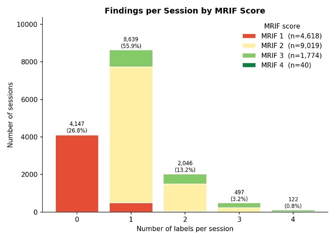
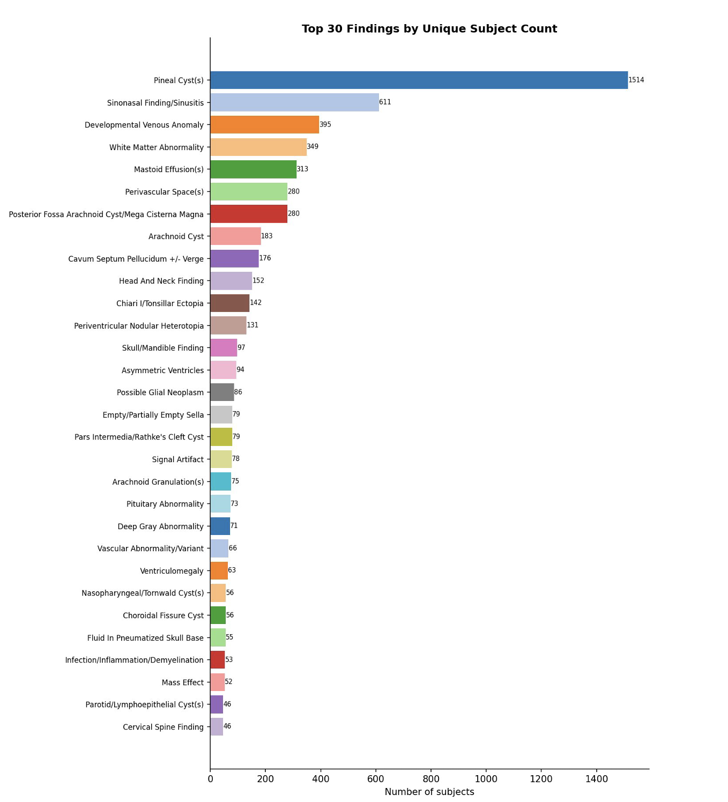

```{r}
#| label: setup
#| include: false 

for (file in list.files("../../../R", full.names = TRUE)) source(file)

expect_series <- readr::read_csv(
  "../../assets/tbl/documentation/imaging/mri_exp_series.csv"
)
```

# General Information

This document details how to obtain information, metrics, and imaging files from the magnetic resonance imaging (MRI) components of the ABCD Study. An in-depth discussion and reference resource on the ABCD processing pipeline is available at <https://doi.org/10.1016/j.neuroimage.2019.116091>.

::: {.callout-note title="Imaging data"}
Imaging data are collected on even years. To cross-reference with non-imaging protocols, please refer to the [Non-imaging section](../non_imaging/index.qmd).
:::

::: {.callout-caution collapse="true" title="Imaging Release Notes"}
**7.0**

-   [**MRI info**](../release_notes/7_0.qmd#mri-info): The form of the serial number anonymization has been standardized across these data types and a new categorical variable is used to reduce number of software version.

-   [**All imaging**](../release_notes/7_0.qmd#all-imaging): \~50 visits that differ for across all modalities, related to recovery of previous processing failures and some re-evaluation of raw QC.

-   [**rsfMRI**](../release_notes/7_0.qmd#rsfrmi): Tabulated data now is based on concatenated data. There are also some changes regarding the processing of data.

-   [**dMRI**](../release_notes/7_0.qmd#dmri): Previously, there was a mismatch of rows in the DTI data files. This has been fixed in 7.0.

-   [**SST**](../release_notes/7_0.qmd#sst): "Stop too early" trials are now reclassified as "go", affecting a large subset of visits.

-   [**MID**](../release_notes/7_0.qmd#mid): There are changes between how the tabulated data was prepared for 7.0 vs. 6.0 data release.

-   [**Post QC**](../release_notes/7_0.qmd#post-qc): \~100-900 visits with differences, depending on modality revisions to previous scores, mostly for FreeSurfer QC.

-   [**Missing data on Siemens `XA30`**](../release_notes/7_0.qmd#missing-data-on-siemens-xa30): Anatomical scans (T1w and T2w) and field map scans (for both dMRI and fMRI) were inadvertently excluded from the sourcedata and rawdata BIDS datasets for the 889 scan sessions collected on Siemens scanners with software version `XA30`.

-   [**Registration quality issue for concatenated voxelwise data**](../release_notes/7_0.qmd#registration-quality-issue-for-concatenated-voxelwise-data): A bug has been identified in the registration pipeline used to produce the ABCD 7.0 concatenated voxelwise data.

**6.0**

-   [**Indicator variables**](../release_notes/6_0.qmd#indicator-variables)

-   [**Missing values**](../release_notes/6_0.qmd#missing-values-in-tabulated-imaging-data)

-   [**Mismatched rows**](../release_notes/6_0.qmd#mismatched-rows-in-concatenated-vertexwise-dti-data)

-   [**Scanner issue**](../release_notes/6_0.qmd#known-issue-scanner-issue-for-site15)
:::

::: {#scanner-issue .callout-warning collapse="true" title="Data consideration: Scanner issue"}
There was a scanner service issue that affects dMRI and fMRI data acquired prior to August 2018 at one of the ABCD sites (Site ID: site15, DeviceSerialNumber: d06b7afa24778649d21924836f3816031db95e5c7a5db0e475f640bb805cdf9f). It is suggested that users should consider excluding dMRI and fMRI data from that scanner collected prior to August 2018.

There was an intermittent spiking problem, thought to be caused by a hardware malfunction, visible as white pixel noise in some scans. The scanner was serviced and the problem fixed in July 2018. The issue was not detected via visual review, but some dMRI- and fMRI-derived measures from scans acquired prior to August 2018 exhibited an offset in group mean values, resulting, for example, in biased estimates of age-related change.
:::

## Nomenclature

Every table in the Imaging domain has the prefix `mr_y_` (`mr`: domain = "imaging"; `y`: source = "youth"), followed by abbreviations to describe the exact imaging data available.

**Subdomain**

-   Administrative: `adm`
-   Quality Control: `qc`
-   Diffusion MRI (DTI): `dti`
-   Diffusion MRI (RSI): `rsi`
-   Resting State fMRI: `rsfmr`
-   Structural MRI: `smr`
-   Task fMRI: `tfmr`

**Metric**

-   *Diffusion MRI (DTI)*
    -   Fractional Anisotropy: `fa`
    -   Longitudinal Diffusivity: `ld`
    -   Mean Diffusivity: `md`
    -   Transverse Diffusivity: `td`
    -   Volume: `vol`
-   *Diffusion MRI (RSI)*
    -   Free Normalized Isotropic: `fni`
    -   Hindered Normalized Directional: `hnd`
    -   Hindered Normalized Isotropic: `hni`
    -   Hindered Normalized Total: `hnt`
    -   Restricted Normalized Directional: `rnd`
    -   Restricted Normalized Isotropic: `rni`
    -   Restricted Normalized Total: `rnt`
-   *Resting State fMRI*
    -   Correlation: `cor`
    -   Temporal Variance: `var`
-   *Structural MRI*
    -   Cortical Thickness: `thk`
    -   Sulcal Depth: `sulc`
    -   Surface Area: `area`
    -   T1 Intensity: `t1`
    -   T2 Intensity: `t2`
    -   Volume: `vol`
-   *Task fMRI*
    -   Emotional N-Back: `nback`
    -   Monetary Incentive Delay: `mid`
    -   Stop Signal Task: `sst`

**Atlas**

-   *Diffusion MRI (DTI)*
    -   AtlasTrack: `at`
    -   Desikan: `dsk`
    -   Destrieux: `dst`
    -   Subcortical: `aseg`
-   *Diffusion MRI (RSI)*
    -   AtlasTrack: `at`
    -   Desikan: `dsk`
    -   Destrieux: `dst`
    -   Subcortical: `aseg`
-   *Resting State fMRI*
    -   Desikan: `dsk`
    -   Destrieux: `dst`
    -   Gordon Parcellations: `gp`
    -   Subcortical: `aseg`
-   *Structural MRI*
    -   Desikan: `dsk`
    -   Destrieux: `dst`
    -   Fuzzy Clustering: `fzy`
    -   Subcortical: `aseg`
-   *Task fMRI*
    -   Behavior: `beh`
    -   Desikan: `dsk`
    -   Destrieux: `dst`
    -   Subcortical: `aseg`

Within the different imaging modalities, variables are grouped into tables using additional criteria. The resulting tables are listed in more detail in the data documentations pages for each specific imaging modality. Users can use [DEAP (Data Exploration and Analysis Portal)](https://nbdc.deapscience.com) to explore what variables a given instrument contains and how instruments are hierarchically organized within the ABCD ontology. Abbreviations of anatomical locations for the ROI-based tabulated imaging tables are detailed in [*Supplementary Imaging Tables*](data_suppl.qmd).

## Expected MRI Series

The number of expected MRI series varies depending on participant scheduling, scanner manufacturer requirements, and repeat acquisitions during scanning. Scanning sessions are typically performed in one session for \~2 hours. However, sometimes the participant prefers completing the scan in two separate 1-hour sessions, typically a few minutes apart but occasionally separated by several days. If the scanning is split over two sessions, an initial T1 is acquired for reference at the start of each session, leading to two available T1 images. Additionally, because the T1 is the first, short essential scan of the session, the operator will repeat the scan if there is a problem with the acquisition (e.g. excessive motion). Other series may also have a repeat acquisition if there is enough time. If multiple acquisitions exceed the expected number of files, users should manually inspect the images for quality assurance.

Below is a guide to the expected number of series per modality/scanner manufacturer:

```{r}
expect_series |>
  tidyr::separate(
    Siemens,
    into = c("Siemens", "Siemens (series)"),
    sep = " (?=\\()",
    fill = "right"
  ) |>
  reactable(
    defaultPageSize = 25,
    resizable = TRUE
  )
```

Note that the order of the task fMRI series acquisition is randomized per subject.

See <https://abcdstudy.org/images/Protocol_Imaging_Sequences.pdf> for more information about ABCD MRI protocols.

# Imaging data sharing

## MRI unprocessed data sharing

Unprocessed MRI data are shared as DICOM files in a BIDS source data format as well as NIfTI files in the standard BIDS raw data format. See [ABCD MRI Unprocessed Data Sharing](../imaging/data_source_raw.qmd) for more information about ABCD MRI Raw Data Sharing.

## MRI derivatives data sharing

Processed MRI data volumes are shared as NIfTI files in a BIDS derivatives format. FreeSurfer outputs are shared in their standard form, also within a BIDS derivatives format. See [ABCD MRI Derivatives Data Sharing](../imaging/data_derivatives.qmd) section for more information about ABCD MRI Derivatives Data Sharing.

# Tabulated ROI-based Analysis

MR images are corrected for distortions and head motion, and cross-modality registrations are performed. Using the T1w sMRI scan, the cortical surface is reconstructed, and subcortical and white matter regions of the brain are segmented. From this, we carry out modality-specific analyses and extract imaging-derived measures using a variety of regions of interest (ROI).

Finally, ROI analysis results are compiled across participants and summarized in tabulated form. Information on the different tabulated imaging data instruments is detailed in modality-specific release notes:

-   [Structural Magnetic Resonance Imaging](type_smri.qmd)
-   [Diffusion Magnetic Resonance Imaging](type_dmri.qmd)
-   [Resting-State Functional Magnetic Resonance Imaging](type_rsfmri.qmd)
-   [Task-Based Functional Magnetic Resonance Imaging (task-fMRI)](type_tfmri.qmd)
-   [Behavioral Performance During Task-Based fMRI](type_tfmribeh.qmd)

Despite the convenience of ROI-based analyses and the advantages related to reduced numbers of statistical comparisons, there are inherent limitations to this approach. Effects of interest (e.g., associations between cortical morphometry and cognitive variables, or task- related fMRI activation) could potentially straddle multiple ROIs, or occupy a small region of a large ROI, thereby reducing the sensitivity of an ROI-based analysis relative to mapping-based approaches. For this reason, users should be cautious about interpreting the results of ROI- based analyses, particularly for task fMRI.

# Quality Control and Recommended Image Inclusion Criteria

QC procedures and image inclusion criteria are described in more detail in the [MRI Quality Control & Recommended Image Inclusion Criteria](type_qc.qmd) data documentation.

## Recommended Inclusion Criteria

The Recommended Imaging Inclusion instrument (`r link_table("mr_y_qc__incl")`) provides the simple option of include or exclude sessions (1 or 0) based on automated and manual QC review per MR measure - T1w, T2w, DTI/RSI, rsfMRI, SST, nBack and MID tfMRI.

## Incidental Findings

Neuroradiologic Review, AI-Assisted Labeling, and Findings Dictionary

### Background and Neuroradiologic Review

Structural MRI data from ABCD study participants have been centrally reviewed for incidental findings (IFs) — potentially important anatomic variants and abnormalities — by board-certified/eligible neuroradiologists under the supervision of a senior neuroradiologist with over 10 years of experience and subspecialized training in pediatric neuroradiology. All T1- and T2-weighted sequences were reformatted in three planes and accessed by reviewers via a dedicated image-review and report-generation web portal. Reporting was not constrained to a prespecified finding list; all detected anatomic variants and structural abnormalities were documented. To promote consistency, reviewers conferred regularly on the clinical significance of specific findings.

Each scan was assigned to one of four mutually exclusive significance categories:

-   **Category 1** — No abnormal findings.
-   **Category 2** — Normal anatomic variant or common incidental finding unlikely to be of clinical significance in a healthy individual; no referral necessary.
-   **Category 3** — Consider referral.
-   **Category 4** — Consider immediate referral.

A free-text field allowed the reviewing radiologist to elaborate on findings and provide guidance on recommended clinical or imaging follow-up. The categorical score and report were automatically transmitted to the responsible investigator at each enrollment site, enabling timely follow-up when warranted.

The baseline neuroradiologic review encompassed 11,687 participants with interpretable MRI scans. Follow-up scans collected at 2-, 4-, 6-, and 8-year intervals have continued to be categorized using the same system. Full details of the baseline review methodology and prevalence findings are reported in @li2021.

### Longitudinal Reporting: "Difference from Prior" Flags

For longitudinal imaging events, the reporting system was updated to include "Difference from Prior" (yes/no) checkboxes alongside each reported finding. These flags indicate whether a described finding represents a change relative to the participant's prior imaging. This distinction is important for two scenarios that the overall categorical score alone cannot capture:

-   **New category 3 or 4 score, Difference from Prior = No:** A finding newly documented at this imaging event that was not detected or reported on prior scans, but is unchanged in appearance.
-   **Unchanged score, Difference from Prior = Yes:** A new finding in a participant who already had an existing finding, such that the overall category score may not change even though there is a new, potentially actionable abnormality.

### AI-Assisted Labeling of Incidental Findings

To date, only the categorical scores derived from the neuroradiologic reports (variable: `mrif_score`) have been made available in released ABCD data. Beginning with release 7.0, a dictionary of finding-level labels is also included. These labels identify the specific anatomic variants or abnormalities described in each report, providing structured information about the identity and location of findings at each imaging event.

Neuroradiologic reports from baseline and longitudinal timepoints were processed using an AI-assisted labeling pipeline to extract and classify specific incidental findings described in free-text report narratives.

#### Platform

Labeling was performed using UCSF Versa, a secure generative AI platform developed by UCSF and approved for use with all UCSF institutional data. Versa operates within a protected environment in which prompts and model responses are transmitted securely and are not retained beyond the active user session.

#### Prompt Development and Application

A structured prompt was engineered to recreate the finding-level labels that had been manually assigned to IFs in the baseline imaging for the 2021 JAMA Neurology publication. The model was prompted to act as a board-certified pediatric neuroradiologist and, for each report, to identify incidental findings by matching report language against a structured finding dictionary containing canonical finding labels and associated keywords and synonyms. Key behavioral rules embedded in the prompt included:

-   Findings mentioned in a negated context (e.g., "no hydrocephalus") were excluded from output.
-   Findings described as benign or normal variants were still labeled if structurally present (e.g., a cavum septum pellucidum noted as a normal variant was still labeled as such).
-   When a report offered a differential, the most likely classification was used.
-   Findings outside the dictionary were captured as free-text under an "Other" label.
-   Output was ordered by descending clinical significance and limited to a maximum of four findings per report.

The prompt was developed iteratively, tested against existing neuroradiologist-assigned labels from the baseline dataset at progressively larger sample sizes (n = 10, 100, 500, and 1,000), with refinements at each stage to improve accuracy. Once validated, the final prompt was applied to the complete baseline dataset and subsequently to all longitudinal reports.

#### Neuroradiologist Review and Dictionary Finalization

Following AI-assisted labeling, all approximately 15,000 generated labels were reviewed by a board-certified neuroradiologist for accuracy. Labels that were redundant or described closely related findings were merged where appropriate. This review process produced the final, curated dictionary of 85 finding labels included in this data release.

### Data Structure and Interpretation

#### Variable Structure

Because up to four labels may apply to a single participant at a given imaging event, the labels are structured as a set of binary indicator variables — one column per finding category — rather than as a single multi-valued field. Variables follow the naming convention `mr_y_qc__clfind_label___N` (e.g., `mr_y_qc__clfind_label___1`, `mr_y_qc__clfind_label___2`), where N corresponds to the finding's alphabetical position in the dictionary. Full variable labels follow the format "Clinical findings: Label \[Finding Name\]" (e.g., "Clinical findings: Label \[Arachnoid Cyst\]").

Values are coded as follows, with one row per participant per imaging event:

-   1 (TRUE): The finding was identified in the report for this imaging event.

-   0 (FALSE): The finding was not identified (applies to all label columns for participants with an MRIF score, including those with no findings).

-   NA / NULL: The participant does not have an MRIF score for this imaging event (i.e., no radiology report was generated).



*Figure 1. Distribution of the number of labels per imaging session, stratified by MRIF score category. The majority of sessions (55.9%) have exactly one label. Sessions with MRIF score 1 (no findings) by definition have zero labels; sessions with scores 3 or 4 tend to carry more labels per session.*

#### Event-Specific Labels and Longitudinal Interpretation

Labels reflect the findings documented in the radiology report for each specific imaging event and were not revised retroactively based on findings at later timepoints. However, because prior imaging and reports were generally available to the reviewing radiologist at each subsequent visit, the interpretation of a given finding — and therefore the label assigned — may evolve over the course of the study. For example, an area of signal abnormality initially labeled as a possible glial neoplasm may be relabeled at later timepoints (e.g., as a white matter abnormality) if the finding remains stable or decreases in prominence, reflecting reduced clinical concern. Labels should therefore be interpreted in the context of the full longitudinal record.

#### Nature of the Labels

The finding labels in this dictionary are heterogeneous in what they describe. Some refer to specific suspected diagnoses (e.g., Syrinx, Chiari I/Tonsillar Ectopia, Craniopharyngioma), others identify the anatomic location of a finding without implying a specific etiology (e.g., Head and Neck Finding, Bone Lesion, Optic Nerve/Chiasm/Tract), and others indicate the presence or suspicion of an underlying process or consequence (e.g., Mass Effect, Intracranial Hypertension, Infection/Inflammation/Demyelination). Users should be aware of this heterogeneity when selecting or combining labels for analysis.

#### Important Limitations

These radiology reports were generated primarily to ensure participant safety, not to provide comprehensive clinical diagnoses. Findings were described without any knowledge of participants' history (medical or otherwise) and using only the limited T1- and T2-weighted anatomic MRI sequences acquired as part of the study protocol. The labels should therefore be considered neither final nor definitive clinical diagnoses. They represent the radiologist's interpretation of isolated structural imaging at the time of review and should be understood as structured summaries of those free-text reports and not confirmed medical findings.

### Incidental Finding Dictionary

The finding dictionary defines the 85 controlled-vocabulary labels used in this data release. Labels are listed alphabetically below and are numbered accordingly for variable construction (`mr_y_qc__clfind_label___1` through `mr_y_qc__clfind_label___85`). Figure 2 shows the 30 most frequently observed findings across all subjects and timepoints.



*Figure 2. The 30 most common incidental finding labels by unique subject count across all imaging timepoints. Pineal cysts are by far the most prevalent finding, followed by sinonasal findings, developmental venous anomalies, and white matter abnormalities.*

|  |  |  |
|----|----|----|
| **Finding Label** | **Finding Label** | **Finding Label** |
| Absence of the Septum Pellucidum | Empty/Partially Empty Sella | Optic Nerve/Chiasm/Tract |
| Aqueductal Stenosis/Web | Encephalocele | Parotid/Lymphoepithelial Cyst(s) |
| Arachnoid Cyst | Evidence of Surgery | Pars Intermedia/Rathke's Cleft Cyst |
| Arachnoid Granulation(s) | Fibrous Dysplasia | Perineural Cyst(s) |
| Asymmetric Ventricles | Fluid in Pneumatized Skull Base | Peripheral Nerve Sheath Tumor(s) |
| Bone Lesion | Head and Neck Finding | Perivascular Space(s) |
| Bone Remodeling | Hippocampal Cyst/Abnormality | Periventricular Nodular Heterotopia |
| Brainstem Abnormality/Variant | Hydrocephalus | Pineal Cyst(s) |
| Cavum Septum Pellucidum +/- Verge | Infection/Inflammation/Demyelination | Pituitary Abnormality |
| Cavum Vellum Interpositum +/- Cyst | Injury/Encephalomalacia | Polymicrogyria |
| Cerebellar Volume Loss/Hypoplasia/Signal Abnormality | Intracranial Hemorrhage/Blood Products | Possible Glial Neoplasm |
| Cerebral Volume Loss | Intracranial Hypertension | Posterior Fossa Arachnoid Cyst/Mega Cisterna Magna |
| Cervical Spine Finding | Intracranial Hypotension | Prominent Subarachnoid Spaces |
| Chiari I/Tonsillar Ectopia | Intraosseous Venous Malformation | Signal Artifact |
| Cholesterol Granuloma | Intraventricular/Periventricular Cyst | Sinonasal Finding/Sinusitis |
| Choroid Plexus Cyst | Lipoma | Sinus Mucous Retention Cyst |
| Choroidal Fissure Cyst | Lymph Node(s) | Skull/Mandible Finding |
| Cord Signal Abnormality | Mass Effect | Suprasellar |
| Corpus Callosum Agenesis/Hypogenesis/Dysgenesis | Mass/Possible Neoplasm | Suspected Cavernous Malformation |
| Corpus Callosum Volume Loss/Signal Abnormality | Mastoid Effusion(s) | Syrinx |
| Cortical Malformation/Dysplasia | Meckel's Cave | Terminal Myelination Zone(s) |
| Craniopharyngioma | Microhemorrhage(s) vs. Calcification(s) | Toxic/Metabolic |
| Cyst (Unspecified) | Mucosal Cyst | Variant Sulcal/Gyral Morphology |
| Deep Gray Nuclei Abnormality | Mucous Retention Cyst | Vascular Abnormality/Variant |
| Dermoid Cyst | Nasopharyngeal/Tornwald Cyst(s) | Venous Hypertension |
| Developmental Venous Anomaly | Neurenteric Cyst | Ventriculomegaly |
| Dilated Central Canal | Neuroglial Cyst(s) | White Matter Abnormality |
| Dura/Dural Sinus | Notochordal Remnant |  |
| Dysplasia/Hamartoma | Odontogenic Cyst(s) |  |

## Protocol Compliance and Quality Control

All ABCD MRI exams have been systematically checked for MRI protocol compliance and completeness, and images have been manually rated for quality by trained MR analysts before and after processing. All MRI data are provided, but we highly recommend that researchers filter subjects by QC results based on the project aims and tolerance for MR artifacts/motion. Severe artifact in all T1w image in a given visit (MRI Quality Control: `iqc_t1_ok_ser = 0`) results in the inability to produce subsequent MR-metrics for all other modalities.

### E-Prime errors in task fMRI

For task fMRI, series were also excluded due to E-Prime problems including missing, corrupted, duplicated or unsynchronized E-Prime files. The variety of E-Prime errors that would invalidate the series are generalized in the task-specific QC instruments as being "mismatched" (`iqc_mid_ep_t_series_match = 1`; `iqc_nback_ep_t_series_match = 1`; `iqc_sst_ep_t_series_match = 1`). In manual review, some errors can be corrected, so there is an additional override to this switch when needed (`eprime_mismatch_ok_mid = 1`; `eprime_mismatch_ok_mid = 1`, `eprime_mismatch_ok_mid = 1`).

### Behavioral performance in task fMRI

Behavioral measures calculated from participant button presses during task fMRI acquisition are also included (see [Behavioral Performance During Task-Based fMRI](type_tfmribeh.qmd) release note). Based on those measures, behavioral performance flags are provided, indicating whether a subject's performance for each task was within acceptable standards. It is suggested that users exclude subjects from group analysis based on sub-optimal performance and possibly additional criteria such as the number of degrees of freedom (reduced by motion censoring) in the individual subject task-fMRI analysis and/or based on outlier detection on the ROI-averages themselves. Users should choose inclusion/exclusion performance criteria that are appropriate for their analyses.

::: {#use-head .callout-important collapse="true" title="Responsible use consideration: Head motion"}
Head motion is a serious issue for neuroimaging, and especially for resting state fMRI. It creates brain-wide artifactual effects including elevated short-distance connectivity and attenuated long-distance connectivity [@power2012]. In order to guard against artifactual effects due to head motion, researchers typically implement a variety of strategies that operate at multiple points of the data collection and processing pipeline, with guidance regularly evolving over time [@power2014; @power2015; @satterthwaite2013; @siegel2017; @gratton2020]. Some of these strategies include discarding entire runs of data that exceed certain motion thresholds and discarding individual functional imaging frames that are proximal to motion events (i.e., "motion censoring"). These strategies in particular typically lead to the exclusion of some participants from further analysis for lack of sufficient data. Levels of head motion differ according to demographic factors such as sex, race/ethnicity, and SES [@cosgrove2022]. Therefore, strategies to deal with head motion may lead to differential exclusions across demographic groups. In addition, data quality procedures cause sessions to vary by the amount of data remaining. Such variability may continue to inflate findings especially in the presence of conditions that may correlate with the motion artifact like autism or ADHD [@eggebrecht2017]. One strategy that avoids this confound is to strictly control the degrees of freedom, where functional connectivity measures are calculated with the exact same amount of data. To aid researchers in exploring this impact further, the ABCD study has released 5 minute- and 10 minute-trimmed and untrimmed functional connectivity datasets. Researchers interested in examining brain-behavior associations or multivariate predictions should follow strategies such as those in @eggebrecht2017: 1) assess how missing data impacts dependent, independent variables and covariates, 2) examine the association between the degrees of freedom and non-FC variables, 3) use trimmed FC measures when needed to mitigate artifacts due to data quality.

For more information please see: ["Resting-state fMRI Data Documentation"](type_rsfmri.qmd).
:::

# Effects of scanner instance and software version {#scan-software-effect}

Multisite longitudinal MRI imaging data are potentially susceptible to influences of scanning parameters, scanner manufacturer, scanner model, and software version, which vary across sites, and sometimes across time. Some multisite correction methods (e.g., COMBAT) [@fortin2017] have been suggested for application to diffusion-weighted, structural, and functional imaging data, including for ABCD data [@dudley2023]. The Imaging Workgroups have verified that scanner effects are detectable in ABCD data and are substantial enough in some circumstances that they warrant correction.

For diffusion imaging, derived-measures obtained from different scanner manufacturers/models have been found to vary substantially. Substantial effects of software updates have also been found on GE scanners between DV25 to DV26, and of Siemens between VE11 and XA30. Philips scanners have had a larger number of minor and major software upgrades, but it is unclear whether these impact the data substantially.

One recommended approach is to include scanner ID and software version as covariates in regression models. For example, this approach was applied by @palmer2022 in their report on age-related changes in restriction spectrum imaging (RSI) metrics calculated from the diffusion-weighted imaging scan. An example model is below:


Investigators should make informed decisions based on the analytic goals. For example, some investigators have recommended including "site", either as a fixed or random effect, in regression models [@dick2021]. However, it may be unnecessary to model "site" as a fixed effect if "scanner ID" is included, but this also may depend on whether random effects are modeled as nested effects (e.g., subject within family within site). In some cases, scanner variables may be collinear with other predictors of interest. For example, if one is examining a specific sub-sample, scanner upgrades may occur between scheduled data collection, increasing the probability that age is collinear with changes in scanner software. Investigators should carefully check their statistical models for issues with multicollinearity. Indeed, in some cases statistical packages will fail to return a result for collinear variables. For example, depending on the analysis, R may fail to return a result, or return a "Singular fit" warning. Investigators may want to assess the Variance Inflation Factor from the car package (e.g., vif(model)), which will return values that indicate the degree of collinearity for each variable in the model. Investigators can manually remove predictors that are collinear.

When running FEMA for voxel- or vertex-wise data analysis, the custom R function makeDesign will check the rank of the design matrix during its construction, and drop columns that are collinear (see <https://github.com/cmig-research-group/cmig_tools/blob/main/cmig_tools_utils/r/makeDesign.R>).

In summary, investigators should be aware of potential effects of scanner manufacturer and software, and carefully control for these effects in their analyses.

# Concatenated data

To facilitate whole-brain analyses of 3D volumes at the voxel-level and cortical surfaces at the vertex level, we have concatenated the complete neuroimaging data from the ABCD Data Release 6.0 across all observations, for multiple imaging phenotypes across all imaging modalities.

# Voxelwise data

To establish anatomical correspondence across all observations, the ABCD atlas was synthesized using the Multimodal Image Normalisation Tool (MINT) developed by the DAIRC. The MINT ABCD atlas is generated from baseline and two-year follow up imaging data and all observations included in Data Release 6.0 from all modalities were registered to the ABCD atlas. Below is a brief overview, for more details please see @pecheva2022.

# Methods

Image processing and analysis methods corresponding to ABCD Release 2.0.1 are described in @hagler2019. Changes to image processing and analysis methods in prior releases are documented below. No significant changes were made to the processing pipeline for Release 5.0 or Release 6.0.

## Changes to 3.0

### dMRI

#### dMRI B0 distortion correction

Moderate to severe residual B0 distortion was noted in manual post-processing QC of a small, but significant portion of dMRI included in previous ABCD releases. Such difficulties were typically caused by substantial head motion during the field mapping scans. The previously used tool for estimation of B0 distortion (@holland2010), was replaced with FSL’s `topup` (FSL v5.0.2.2) (@andersson2003), which was found to provide more accurate B0 distortion correction in the presence of head motion between forward and reverse phase-encode polarity scans.

### rsfMRI

#### Philips fMRI data

In Release 2.0.1 and earlier, all task and resting-state fMRI data obtained on Phillips scanners were incorrectly processed. The field map direction for these data was mistakenly flipped, which led to increased distortion in processed fMRI images. 1512 participants were affected by this issue, which is 13% of baseline MRI visits. This was corrected in Release 3.0.

#### fMRI B0 distortion correction

As for dMRI, the previously used tool for estimation of B0 distortion (@holland2010), was replaced with FSL’s `topup` (FSL v5.0.2.2) (@andersson2003), which was found to provide more accurate B0 distortion correction in the presence of head motion between forward and reverse phase-encode polarity scans.

For fMRI, we also found in some cases that residual distortion was due to poor registration between the spin echo field mapping scans used to estimate B0 distortions and the gradient echo fMRI scans. Inaccurate registration in such cases was caused by the use of a brain mask, derived from log transformed intensities of the the spin echo and gradient echo images, that omitted the center of the brain, due to the strong intensity differences related to distance from the coils. We replaced this method for generating a brain mask for use in registration with FSL’s brain extraction tool (`bet`, FSL v5.0.2.2), which robustly estimates a brain mask from T~1~- or T~2~- weighted images without interior holes. This change corrected the registration between the field map and fMRI scans, resulting in more accurate B0 distortion correction for those scans.

#### Global signal regression for participants with small ventricles

As part of the rs-fMRI analysis preprocessing, average time series in eroded white matter, whole brain, and ventricles are used for global signal regression. A small number of participants with very small ventricles had missing results because no ventricle voxels survived a 1-voxel erosion, which previously led to a processing error. In such cases, the non-existent ventricle time series was omitted from the global signal regression.

### tfMRI

#### Philips fMRI data

In Release 2.0.1 and earlier, all task and resting-state fMRI data obtained on Phillips scanners were incorrectly processed. The field map direction for these data was mistakenly flipped, which led to increased distortion in processed fMRI images. 1512 participants were affected by this issue, which is 13% of baseline MRI visits. This has been corrected in Release 3.0.

#### fMRI B0 distortion correction

As for dMRI, the previously used tool for estimation of B0 distortion (@holland2010), was replaced with FSL’s `topup` (FSL v5.0.2.2) (@andersson2003), which was found to provide more accurate B0 distortion correction in the presence of head motion between forward and reverse phase-encode polarity scans. For fMRI, we also found in some cases that residual distortion was due to poor registration between the spin echo field mapping scans used to estimate B0 distortions and the gradient echo fMRI scans. Inaccurate registration in such cases was caused by the use of a brain mask, derived from log transformed intensities of the the spin echo and gradient echo images, that omitted the center of the brain, due to the strong intensity differences related to distance from the coils. We replaced this method for generating a brain mask for use in registration with FSL’s brain extraction tool (`bet`, FSL v5.0.2.2), which robustly estimates a brain mask from T~1~- or T~2~- weighted images without interior holes. This change corrected the registration between the field map and fMRI scans, resulting in more accurate B0 distortion correction for those scans.

#### Task fMRI analysis exclusions

For task fMRI analysis, data collected for some participants should be excluded from the individual participant analysis processing to prevent matching task fMRI imaging data to the wrong event time series derived from stimulus and response timing files exported from E-Prime. For example, in some cases, due to human error, E-Prime files associated with a given participant were actually acquired with a different participant at the same imaging site, leading to large inconsistencies in time stamps in the E-Prime files and associated task fMRI imaging data. In other cases, due to irregularities in data acquisition, such as aborted scans and/or additional scans, it can be difficult to determine the correct matching between E-Prime files and tfMRI scans. In previous releases, participants with significant timing delays were excluded after processing from the tfMRI tabulated data based on a list of pGUID-events with timing mismatches between E-Prime files and tfMRI scans greater than 12.5 minutes. This list was manually edited to remove pGUID-events for whom timing mismatches could be explained; e.g., consistent clock differences between stimulus laptop and scanner console computers. Note that variable timing offsets (e.g., 1-3 minutes) are common and related to imprecision in the recorded SeriesTime in DICOM files. For Release 3.0, the task fMRI analysis software was modified to automatically exclude events from tfMRI analysis processing if there was a timing mismatch greater than 12.5 minutes (i.e., `iqc_mid_ep_t_series_match` = 0) unless the timing mismatch had been marked as acceptable (i.e., `eprime_mismatch_ok_mid` = 1). Concerning which pGUID-events for which task fMRI results ended up being included in Release 3.0, this was a change in procedure, but generally not outcome.

In previous releases, participants were also excluded from tfMRI analysis processing if the number of valid scans did not match the number of E-Prime runs. For Release 3.0, this was loosened slightly to allow analysis processing in cases with one of two scans being unavailable, either because the other scan was incomplete (i.e., aborted) or failed raw QC. For the SST task, this single scan analysis was allowed whether it was the first or second run; but for MID and nBack tasks, the single scan analysis was allowed only if it was the first run. This difference reflects the interchangeability of the SST runs and a difference between the first and second runs for the MID and nBack tasks. Analysis processing was still skipped for other cases of non- standard acquisitions (e.g., three scans and two available E-Prime runs). An additional change that allowed analysis in some cases not previously allowed applied to multiple pairs of task fMRI scans, sometimes collected on two different imaging study dates (e.g., a repeat acquisition to correct for problems with first attempt). In those cases, the last valid pair of scans corresponding to the same E-Prime file was used for analysis. Another change related to a rare scenario where the first of two runs for a given task was done with the scan protocol for one of the other tasks. In previous releases, those cases would be excluded from analysis processing because the number of scans labeled correctly did not match the number of E-Prime runs. For Release 3.0, in cases where a single scan was preceded by a scan of one of the other task fMRI types, the valid scan would be allowed for analysis as a single run (SST only), matching to the second E-Prime run.

#### E-Prime file handling and time delay calculation

Minor changes were made to recover task fMRI derived results for a small number of pGUID- events, for example by handling unusual file naming for E-Prime exported files (e.g., duplicate file extension: `.txt.txt`) or irregularities within the E-Prime files (e.g., nback experiments terminated before last run completed).

Changes to E-Prime file handling were made related to how the relative time delay variables were calculated, to match each scan to individual runs within a given E-Prime file and to exclude non-ABCD-compliant (i.e., aborted scans) from time-difference calculations, reducing the maximum delay calculated for some participant-event-tasks.

### tfMRI (Behavioral Performance)

#### Stop Signal Task behavioral measures

The SST behavioral variable `tfmri_sst_all_beh_total_meanrt` was removed, and two new variables were added:

-   `tfmri_sst_all_beh_total_mssrt`: Stop Signal Reaction Time, mean estimation
-   `tfmri_sst_all_beh_total_issrt`: Stop Signal Reaction Time, integration estimation

## Changes to 4.0

### dMRI

#### dMRI registration to T~1~w

The procedure for registration of T~2~-weighted images (including dMRI b=0 images) to T~1~-weighted images involves a pre-registration of the T~1~w image to a T~1~w atlas, pre-registration of the T~2~w image to a T~2~w atlas (co-registered to the T~1~w atlas), and then fine registration between the T~2~w and T~1~w images using mutual information. In rare cases, the pre-registration of the T~1~w image to the T~1~w atlas essentially failed, subsequently resulting in a poor registration between the T~2~w and T~1~w images. To reduce the likelihood of registration failure, the T~1~w atlas was edited by applying a brain mask, preventing non-brain regions of the atlas from influencing the registration.

#### dMRI processing: between-scan registration

Between-scan registration procedures for dMRI were modified to use a more robust method for generating a brain mask from the dMRI images for use in constraining the registration between scans of the same modality. The previous method generated a brain mask by applying a cumulative probability threshold to log transformed intensities. In some cases with strong intensity differences related to distance from the coils, the center of the brain was omitted from the mask, resulting in inaccurate between-scan registration in those cases. We replaced this method with the use of FSL’s brain extraction tool (bet, FSL v5.0.2.2), which robustly estimates a brain mask from T~1~- or T~2~-weighted images without interior holes. This change generally had very little effect for most participant-events but prevented bad registration between scans in those rare cases with brain masks that omitted a large portion of the center of the brain. See also above, dMRI registration to T~2~w.

#### dMRI processing: field map slice prescription mismatches

In some scanning sessions, participants need to exit and return to the scanner midway through the scan session, leading to differences in the exact slice prescription for scans of the same type. Specifically for the estimation of B0 distortion fields from forward and reverse phase- encode polarity “field map” scans, such differences in slice prescription invalidate assumptions underlying the basic estimation approach. Differences in the slice prescription can also be associated with differences in head position that may lead to differences in the B0 distortion field, again invalidating assumptions and potentially leading to grossly inaccurate B0 distortion corrections. To avoid these potential problems in past versions of the processing pipeline, processing was aborted for those cases where there was a mismatch in the voxel to scanner space transformation (`vox2ras`) between the forward and reverse field map scans.

In the current processing pipeline, we have relaxed this requirement, allowing the estimation of B0 distortion fields to proceed despite relatively large slice position offset differences (\< 10 mm) of the slice prescription. This is made possible by the use of FSL’s `topup`, which corrects for head motion between the forward and reverse scans when estimating the B0 distortion field.

Differences in voxel dimensions between forward and reverse scans are still not allowed in the current processing pipeline. A further modification was to pre-select the pairs of forward and reverse field map scans in a scan session with matching voxel dimensions and minimal slice position offsets. This prevents unnecessary processing failures in rare cases in which there were multiple scans with varying slice prescriptions and/or voxel dimensions.

#### RSI model and data structures

The restriction spectrum imaging (RSI) model used to fit the multishell diffusion data was modified to include a “free water” component, complementing the “restricted” and “hindered” signal fractions. As before, the signal fractions representing restricted (e.g., intracellular) and hindered (e.g., extracellular) diffusion were modeled as fourth order spherical harmonic, fiber orientation density (FOD) functions. For both of these fractions, the LD is modeled as 1.0 x 10^-3^ mm^2^/s. For the restricted fraction, TD is modeled as 0. For the hindered fraction, TD is modeled as 0.9 x 10^-3^ mm^2^/s. The free water fraction was modeled as isotropic diffusion with an apparent diffusion coefficient (ADC) of 3.0 x 10^-3^ mm^2^/s.

Measures derived from this RSI model fit included restricted normalized isotropic (RNI), restricted normalized directional (RND), restricted normalized total (RNT), hindered normalized isotropic (HNI), hindered normalized directional (HND), and hindered normalized total (HNT), and free normalized isotropic (FNI). These normalized RSI measures are unitless and range from 0 to 1. Note that these abbreviations differ from those used in previous releases and in @hagler2019. RNI and HNI were previously called N0 and N0_s2, respectively. RND and HND were previously called ND and ND_s2. RNT and HNT were previously called NT and NT_s2. FNI was not previously included. The tabulated data structures for RSI-derived ROI average measures have been replaced for ABCD Release 4.0 (`abcd_drsip101`, `abcd_drsip201`, `abcd_drsip301`, `abcd_drsip401`, `abcd_drsip501`, `abcd_drsip601`, and `abcd_drsip701`), with each data structure corresponding to one RSI-derived measure for all ROIs.

#### Changes to data dictionaries

-   New NDA data structures `abcd_drsip101`, `abcd_drsip201`, `abcd_drsip301`, `abcd_drsip401`, `abcd_drsip501`, `abcd_drsip601`, and `abcd_drsip701` replacing `mri_rsi_p102`, `mri_rsi_p202`, `abcd_drsidp101`, `abcd_drsidp201`, and `abcd_drsidp301`
-   New element names, descriptions, and DEAP aliases
-   Variables grouped into instruments by measure
-   New free normalized isotropic (FNI) measures in NDA data structure `abcd_drsip701`

### rsfMRI

#### fMRI registration to T~1~w

The procedure for registration of T~2~-weighted images (including fMRI field map scans) to T~1~- weighted images involves a pre-registration of the T~1~w image to a T1w atlas, pre-registration of the T~2~w image to a T~2~w atlas (co-registered to the T~1~w atlas), and then fine registration between the T~2~w and T~1~w images using mutual information. In rare cases, the pre-registration of the T~1~w image to the T~1~w atlas essentially failed, subsequently resulting in a poor registration between the T~2~w and T~1~w images. To reduce the likelihood of registration failure, the T~1~w atlas was edited by applying a brain mask, preventing non-brain regions of the atlas from influencing the registration.

#### fMRI processing: between-scan registration

Between-scan registration procedures for fMRI were modified to use a more robust method for generating a brain mask from the fMRI images for use in constraining the registration between scans of the same modality. The previous method generated a brain mask by applying a cumulative probability threshold to log transformed intensities. In some cases with strong intensity differences related to distance from the coils, the center of the brain was omitted from the mask, resulting in inaccurate between-scan registration in those cases. We replaced this method with the use of FSL’s brain extraction tool (bet, FSL v5.0.2.2), which robustly estimates a brain mask from T~1~- or T~2~-weighted images without interior holes. This change generally had very little effect for most participant-events, but prevented bad registration between scans in those rare cases with brain masks that omitted a large portion of the center of the brain.

#### fMRI processing: field map slice prescription mismatches

In some scanning sessions, participants need to exit and return to the scanner midway through the scan session, leading to differences in the exact slice prescription for scans of the same type. Specifically for the estimation of B0 distortion fields from forward and reverse phase-encode polarity “field map” scans, such differences in slice prescription invalidate assumptions underlying the basic estimation approach. Differences in the slice prescription can also be associated with differences in head position that may lead to differences in the B0 distortion field, again invalidating assumptions and potentially leading to grossly inaccurate B0 distortion corrections. To avoid these potential problems in past versions of the processing pipeline, processing was aborted for those cases where there was a mismatch in the voxel to scanner space transformation (`vox2ras`) between the forward and reverse field map scans.

In the current processing pipeline, we have relaxed this requirement, allowing the estimation of B0 distortion fields to proceed despite relatively large slice position offset differences (\< 10 mm) of the slice prescription. This is made possible by the use of FSL’s `topup`, which corrects for head motion between the forward and reverse scans when estimating the B0 distortion field.

Differences in voxel dimensions between forward and reverse scans are still not allowed in the current processing pipeline. A further modification was to pre-select the pairs of forward and reverse field map scans in a scan session with matching voxel dimensions and minimal slice position offsets. This prevents unnecessary processing failures in rare cases in which there were multiple scans with varying slice prescriptions and/or voxel dimensions.

#### fMRI processing: between scan registration

Between scan registration for fMRI (using AFNI’s `3dvolreg`) sometimes failed (i.e., produced grossly inaccurate registrations) in cases with large differences in the slice position offset relative to scanner coordinates, e.g., due to exiting and re-entering the scanner midway through the scan session. This problem was corrected by replacing the voxel to scanner coordinate transformation (`vox2ras` matrix) for a given scan with that of the registration target volume if the difference in slice position offset was greater than 1 mm, as long as there was no rotation of the slice plane. In rare cases with such rotations, the input image was resampled before registration to remove rotations as well as the nominal offset.

#### fMRI processing: within-scan motion correction

The procedure for motion correction of fMRI data was modified to use the mean image as the registration target rather than the first frame of each series. The mean image was calculated by averaging over all time points, excluding the initial 16 frames. This change generally had minimal effect on the quality of registration (as assessed by within-series temporal SNR), but was done to avoid poor registration for series with poor image quality in the first frame.

#### rsfMRI analysis-specific preprocessing

Processing and analysis of rsfMRI data include analysis-specific preprocessing steps, following the “minimal processing” in common with task fMRI. These preprocessing steps include regression and residualization to remove signals related to global oscillations or head motion, with frames with displacement (FD) greater than 0.3 mm excluded (or censored) from the regression. A subsequent linear interpolation step, in which values for the censored frames are replaced through linear interpolation, is important for preventing motion contamination in the subsequent band-pass filtering but was previously omitted. This omission has now been corrected, resulting in a large reduction in the number of subjects with high outlier temporal variance values and a slight reduction in the overall median temporal variance. The across-participant averages of between-ROI correlations were generally unchanged, but there was a substantial reduction in between-participant variation.

#### rsfMRI analysis

A minor coding error in the rsfMRI analysis pipeline led to missing derived results in rare cases if the first rsfMRI scan in a scan session had no usable data (i.e., due to excessive motion). Fixing this led to the recovery of derived results for the remaining scans with usable data for such participant-events.

### tfMRI

#### Task fMRI registration to T~1~w

The procedure for registration of T~2~-weighted images (including fMRI field map scans) to T~1~- weighted images involves a pre-registration of the T~1~w image to a T~1~w atlas, pre-registration of the T~2~w image to a T~2~w atlas (co-registered to the T~1~w atlas), and then fine registration between the T~2~w and T~1~w images using mutual information. In rare cases, the pre-registration of the T~1~w image to the T~1~w atlas essentially failed, subsequently resulting in a poor registration between the T~2~w and T~1~w images. To reduce the likelihood of registration failure, the T~1~w atlas was edited by applying a brain mask, preventing non-brain regions of the atlas from influencing the registration.

#### Task fMRI processing: between-scan registration

Between-scan registration procedures for fMRI were modified to use a more robust method for generating a brain mask from the fMRI images for use in constraining the registration between scans of the same modality. The previous method generated a brain mask by applying a cumulative probability threshold to log transformed intensities. In some cases with strong intensity differences related to distance from the coils, the center of the brain was omitted from the mask, resulting in inaccurate between-scan registration in those cases. We replaced this method with the use of FSL’s brain extraction tool (`bet`, FSL v5.0.2.2), which robustly estimates a brain mask from T~1~- or T~2~-weighted images without interior holes. This change generally had very little effect for most participant-events, but prevented bad registration between scans in those rare cases with brain masks that omitted a large portion of the center of the brain.

#### Task fMRI processing: field map slice prescription mismatches

In some scanning sessions, participants need to exit and return to the scanner midway through the scan session, leading to differences in the exact slice prescription for scans of the same type. Specifically for the estimation of B0 distortion fields from forward and reverse phase- encode polarity “field map” scans, such differences in slice prescription invalidate assumptions underlying the basic estimation approach. Differences in the slice prescription can also be associated with differences in head position that may lead to differences in the B0 distortion field, again invalidating assumptions and potentially leading to grossly inaccurate B0 distortion corrections. To avoid these potential problems in past versions of the processing pipeline, processing was aborted for those cases where there was a mismatch in the voxel to scanner space transformation (`vox2ras`) between the forward and reverse field map scans.

In the current processing pipeline, we have relaxed this requirement, allowing the estimation of B0 distortion fields to proceed despite relatively large slice position offset differences (\< 10 mm) of the slice prescription. This is made possible by the use of FSL’s topup, which corrects for head motion between the forward and reverse scans when estimating the B0 distortion field. Differences in voxel dimensions between forward and reverse scans are still not allowed in the current processing pipeline. A further modification was to pre-select the pairs of forward and reverse field map scans in a scan session with matching voxel dimensions and minimal slice position offsets. This prevents unnecessary processing failures in rare cases in which there were multiple scans with varying slice prescriptions and/or voxel dimensions.

#### Task fMRI processing: between scan registration

Between scan registration for fMRI (using AFNI’s `3dvolreg`) sometimes failed (i.e., produced grossly inaccurate registrations) in cases with large differences in the slice position offset relative to scanner coordinates, e.g., due to exiting and re-entering the scanner midway through the scan session. This problem was corrected by replacing the voxel to scanner coordinate transformation (`vox2ras` matrix) for a given scan with that of the registration target volume if the difference in slice position offset was greater than 1 mm, as long as there was no rotation of the slice plane. In rare cases with such rotations, the input image was resampled before registration to remove rotations as well as the nominal offset.

#### Task fMRI processing: within-scan motion correction

The procedure for motion correction of fMRI data was modified to use the mean image as the registration target rather than the first frame of each series. The mean image was calculated by averaging over all time points, excluding the initial 16 frames. This change generally had minimal effect on the quality of registration (as assessed by within-series temporal SNR), but was done to avoid poor registration for series with poor image quality in the first frame.

#### Task fMRI scan to E-Prime file matching and time delay calculation

The task fMRI behavioral and stimulus timing files, which are exported from the E-Prime stimulus presentation program, have a date and time stamp recording when the stimulus program was started for a particular task run. E-Prime timing is compared to date and time derived from imaging DICOM metadata to identify events with potentially mismatched E-Prime file and imaging data (e.g., `iqc_mid_ep_t_series_match`). The method for matching tfMRI series to E-Prime files was changed, affecting the calculation of relative time delays between DICOM- derived SeriesTime and E-Prime file-derived time stamps. Previously, each scan was matched to the E-Prime file with minimum relative time delay; i.e., if there were multiple attempted scans. In cases with a small but significant apparent time delay (e.g., 4 minutes), E-Prime files from multiple attempted runs may have similar absolute delays as each other (e.g., -4 minutes and +3 minutes), resulting in ambiguity. To disambiguate such cases, we now match each scan to the individual runs in the E-Prime file and attempt to find a time delay that is more or less constant across runs and tasks in a given scan session, while matching consecutive scans to consecutive runs (rather than allowing one E-Prime run to be match ambiguously to more than one scan). This has the end result of a reduction in the maximum delay calculated for some pGUID-event-tasks and more confident matching of E-Prime runs to each scan.

#### Task fMRI analysis exclusions

For most participant-events with task fMRI data, the standard acquisition protocol was followed, with two scans for each task and one stimulus and response timing file (exported from E-Prime) containing timing information for two runs. However, in some cases, the standard protocol was not followed, potentially introducing ambiguity in how to correctly match tfMRI scans to their corresponding E-Prime behavioral run. For example, participants sometimes ask to stop a scan early; e.g., too tired, bathroom break. This results in either a single usable scan and two E-Prime runs, or multiple scans and one or more runs in multiple E-Prime files. More scans and/or runs than the standard acquisition can also be related to reacquisition following technical problems, e.g., non-functioning trigger or unrecorded responses. In a very small number of participant- events (\< 0.1%), the wrong scan protocol was used for the first run of a given stimulus; e.g., using the MID scan protocol while using the SST stimulus. A final source of uncertainty and ambiguity comes from the possibility that, due to human error with initial data upload, the E-Prime files associated with a given participant were sometimes actually acquired with a different participant-event at the same imaging site, leading to large inconsistencies in time stamps in the E-Prime files and associated task fMRI imaging data.

In ABCD Release 1 and 2, to avoid pairing the wrong stimulus run with the wrong scan, tfMRI analysis processing was only allowed in cases with the standard acquisition of two scans and two behavioral runs from a single E-Prime file or one scan and one behavioral run. Results were also excluded if there was an unexplained timing mismatch; i.e., the difference between SeriesTime extracted from DICOM header and E-Prime session time was greater than 12.5 minutes. Such exclusions would have resulted in missing derived values in the task fMRI tabulated data and missing minimally processed data for those participant-event-tasks.

In ABCD Release 3.0, small changes were made to the rules guiding which data were analyzed, allowing for some additional irregular acquisitions under limited circumstances. For example, in cases with multiple pairs of tfMRI scans, sometimes collected on two different dates, the last valid pair of scans corresponding to the same E-Prime file was used for analysis. Also, single scans corresponding to the second behavioral run (e.g., because of an aborted scan, failed QC, or wrong scan protocol for first run) were allowed for analysis for SST, though not MID or nBack, because of the interchangeability of the SST runs and differences between the first and second runs for the MID and nBack tasks. Data with a timing mismatch greater than 12.5 minutes (e.g., `iqc_mid_ep_t_series_match` = 0) were again excluded, unless the timing mismatch had been marked as acceptable (e.g., `eprime_mismatch_ok_mid` = 1).

For Release 4.0, the rules for skipping the analysis of task fMRI data were again updated slightly to broaden the circumstances under which the analysis processing would be run for irregular acquisitions. The changes relied on more precise matching of scans to individual behavioral runs (see Task fMRI scan to E-Prime file matching and time delay calculation) and a check for consistency of timing delays across runs and tasks in a given scan session. In cases with two or more scans, individual scans were first excluded if the timing delay was greater than 12.5 minutes different from the median delay. For cases with multiple pairs of tfMRI scans, the last valid pair of scans corresponding to the same E-Prime file or the last complete scan from the last day of scanning was used for analysis. Handling of run numbers in irregular acquisitions was changed for some cases; cases with two valid scans and two runs from separate E-Prime files are now allowed for analysis. Also now allowed for each task are single scans corresponding to the second behavioral run (e.g., because of an aborted scan, failed QC, or wrong scan protocol for first run), with results now correctly assigned to the run 2 variables. In the case of two runs 1, this was allowed for SST, but not for MID and nBack, for which only the first singleton run was used. Analysis processing was allowed if the minimum delay for the selected scans was less than 12.5, or if there were multiple scans in the scanning session and the range of timing delays for those scans (including scans for other tasks) was less than 4 minutes, or if the timing mismatch had been marked as acceptable (e.g., `eprime_mismatch_ok_mid` = 1). Analysis was not allowed for cases with absolute timing delays greater than 720 minutes, regardless of the range of timing delays across runs and tasks. For those participant-event-tasks that had been allowed for analysis despite timing delays greater than 12.5 minutes, the `eprime_mismatch_ok_mid`, `eprime_mismatch_ok_nback`, and `eprime_mismatch_ok_sst` variables were set to 1 so that they would pass the inclusion criteria.

### tfMRI (Behavioral performance)

#### Task fMRI E-Prime file behavioral responses

E-Prime files for a small number of pGUID-events have string response (e.g., "LEFTARROW" vs "RIGHTARROW") instead of numeric (i.e., 1 vs 2). Minor changes were made to handle these cases (for SST and nBack tasks), resulting in the recovery of task fMRI and behavioral results for such cases.

#### MID task behavioral measures

In the initial version of the MID task used for ABCD, only reaction time (RT) for positive feedback trials were able to be calculated. For the current version of the MID task, which was implemented in late 2017, RT can be calculated for all valid trials (i.e., including late responses but excluding early responses). In past releases, variables for negative feedback trials and all trials combined had empty values. In the current release, scan sessions with the current task version now have values for all of these RT variables. For participant-events using the original MID task, those variables remain empty. The method for setting the performance flag variable `tfmri_mid_beh_performflag` (in table `mri_y_tfmr_mid_beh`) was changed to require at least 20 responses per run to be considered acceptable performance for inclusion in analyses. The old method for setting the performance flag was to require at least 4 of each trial type across runs. This method is now used to set the new variable `tfmri_mid_feedbackflag`, which is provided as an additional, optional filter not included in the recommended inclusion criteria used to set the inclusion flags in `mri_y_qc_incl`.

#### Miscellaneous changes to E-Prime file handling and variable extraction

-   Truncated DICOM-derived SeriesTime instead of rounding, affecting calculated time delays.

-   E-Prime file with special (problematic) characters in the file name was renamed, avoiding errors that prevented task fMRI analysis for that participant-event.

-   Set E-Prime derived variables to NaN instead of 0 in case of missing or invalid E-Prime file.

-   Created variables indicating whether experiment name matches labeling of E-Prime file (e.g., `iqc_mid_ep_exper_ok`) and has readable behavioral data (e.g., `iqc_mid_ep_behav_readable`).

#### Changes to data dictionaries

-   Modified NDA data structure `abcd_mid02`

    -   Added element `tfmri_mid_beh_feedbackflag`

    -   Changed description for element `tfmri_mid_beh_performflag`

### sMRI

#### sMRI processing: registration to atlas

The sMRI processing pipeline has included registration to a pre-existing, custom in-house T~1~w atlas and rigid body resampling. In rare cases this registration step may fail (e.g., in some participants with enlarged ventricles), resulting in non-standard head orientations in the processed data for those participant-events. In the current processing pipeline, we use a new ABCD-specific atlas that reduces the frequency of failed registration to atlas.

#### sMRI processing: bias correction

The correction of sMRI T~1~w and sMRI T~2~w images for intensity inhomogeneity uses a smoothly varying bias field constrained to have uniform intensities in voxels segmented as white matter. In addition, outlier voxels, defined as voxels in the white matter mask with low T~1~w intensities or high T~2~w intensities, are removed from the white matter mask. This was done to prevent slight inaccuracies in the initial white matter mask from causing poor bias field estimation in those regions with outlier intensities in voxels labeled as white matter. In the current pipeline, the smoothing algorithm for generating the bias field was changed slightly to use a robust, sparse smoothing algorithm with parameters optimized for a slightly more flexible (less smooth) bias field to better handle locally steep intensity gradients. The removal of outlier voxels from the white matter mask was done iteratively and was limited to the outer band (\~1 cm) of white matter. For T~2~w images, a bug in the previous implementation of the outlier removal resulted in a sparse, slightly shrunken white matter mask. Correcting this issue resulted in a less sparse white matter mask and more spatially uniform bias correction for the T~2~w images than before.

#### T~2~w registration to T~1~w

The procedure for registration of sMRI T~2~w to T1-weighted images involves a pre-registration of the T~1~w image to a T~1~w atlas, pre-registration of the T~2~w image to a T~2~w atlas (co-registered to the T~1~w atlas), and then fine registration between the T~2~w and T~1~w images using mutual information. In rare cases, the pre-registration of the T~1~w image to the T~1~w atlas essentially failed, subsequently resulting in a poor registration between the T~2~w and T~1~w images. To reduce the likelihood of registration failure, the T~1~w atlas was edited by applying a brain mask, preventing non-brain regions of the atlas from influencing the registration.

#### FreeSurfer version

The FreeSurfer version was updated from 5.3.0 to 7.1.1. Changes to FreeSurfer processing across versions are documented [here](https://surfer.nmr.mgh.harvard.edu/fswiki/ReleaseNotes). Differences in the resulting surfaces and subcortical ROIs were generally quite small and free of systematic bias, but it should be noted that the sulcal depth measure differs in scale by a factor of 10 (i.e., now in units of mm instead of cm), resulting in large differences in the “sulc” ROI-averages included in the tabulated imaging data (in data NDA data structure `abcd_smrip102`).

#### Changes to data dictionaries

-   New versions of NDA data structures `abcd_smrip102`, `abcd_smrip202`, and `abcd_smrip302` based on `abcd_smrip101` and `abcd_smrip201`

-   Split data structures to separate FreeSurfer-derived morphometry, T~1~w intensities, and T~2~w intensities

-   Removed unused aliases

-   New versions of NDA data structures `abcd_mrisdp102`, `abcd_mrisdp202`, and `abcd_mrisdp302` based on `abcd_mrisdp101` and `abcd_mrisdp201`

-   Split data structures to separate FreeSurfer-derived morphometry, T~1~w intensities, and T~2~w intensities

-   Removed unused aliases

## Changes to 6.0

### Task-based fMRI

#### Event timing offset for GE scanners

There was previously a discrepancy in how stimulus times were modeled relative to the end of the calibration/dummy volumes in the image acquisition that affects GE scanners. The issue is related to how the E-prime tasks were programmed for GE scanners that resulted in an unexpected timing offset of 800 msec or less.

We modified our code for extracting event timing information from ABCD E-prime files (https://github.com/ABCD-STUDY/abcd_extract_eprime.git). Rather than rely on the first fixation event (e.g., CueFix.OnsetTime) the modified code now uses the timing data from the initial and or final trigger events (e.g., GetReady.RTTime) to determine the reference time that represents the start of the first non-dummy image volume. We also modified the number of initial volumes discarded prior to task fMRI time series analysis for GE scanners, with 4 volumes removed for GE DV26 and 15 volumes removed for GE DV26 and later.

#### E-Prime timing errors for GE scanners

In a relatively small, though substantial, subset of task fMRI acquisitions collected on GE scanners (\~9% of runs), the time between the 1st and 16th trigger pulse sent from the scanner does not match the expected 12 seconds.

We modified our task fMRI analysis pipeline to calculate trigger pulse timing discrepancies to identify E-prime runs for which the delay between the first trigger pulse and last recorded trigger pulse does not match the expectation (12 seconds for GE scanners). In cases where the discrepancy was either 0.8, 1.6, or 2.4 seconds (or within 0.01 seconds of those values), indicating missed (undetected) trigger pulses (\~3% of runs), we adjusted the start time (used as the reference for subsequent events) by subtracting the discrepancy. We further modified the task fMRI analysis pipeline to exclude from processing any other runs that had a start time discrepancy (absolute difference from expectation relative to initial trigger pulse) larger than 0.5 seconds (\~6% of runs), as such cases reflect irregular trigger timing and make it difficult or impossible to be sure when the stimulus run started relative to the imaging scan. For imaging visits with no valid task fMRI runs due to timing discrepancies, no derived results will be produced, and the imaging inclusion flags for the corresponding task will be set to 0. See [Data Documentation](type_tfmri.qmd).

We also sought to identify runs for which the delay between the start of the run and the onset of the first fixation does not match the expectation (500 msec for 1st nBack run on GE scanners, 0 msec otherwise). Runs with an onset time delay greater than 5 seconds were excluded from processing. Smaller discrepancies (i.e., up to 5 seconds) were allowed for this type of delay, because they do not introduce an error in the time series analysis, like an unknown delay between the start of the scan and the start of the run would. Instead, there is merely a shift in the timing of events relative to the start of the run, which can be correctly modeled.

### Column misnaming in rsfMRI network to subcortical ROI correlation tabulated data

The column names in the table [`mr_y_rsfmri__corr__gpnet__aseg`](https://abcd.deapscience.com/?hierarchyOrder=%5B%22study%22%2C%22domain%22%2C%22subDomain%22%2C%22source%22%2C%22metric%22%2C%22atlas%22%5D&hierarchy=%5B%5B%22Youth%22%2C%22MRS+%28HERMES%29+%5BYouth%5D%22%5D%2C%5B%22Correlation%22%2C%22Resting+State+fMRI+-+Correlations+%28Gordon+network+to+Subcortical%29+%5BYouth%5D%22%5D%5D#/my-datasets/create-dataset), which contains the tabulated imaging data for rsfMRI correlations between networks and subcortical ROIs, were corrected in the current release. In previous releases, columns were systematically misnamed. That is, the ordering of the column names did not match the ordering of the values of the columns. This problem was caused by swapping the inner and outer loops when iterating over networks and subcortical ROIs while constructing the column names. For example, to correctly match the data, instead of all ROIs for the first network having been listed first, all networks for the first ROI should have been listed first.

## Changes to 6.1

### Changes to task fMRI behavioral performance and inclusion flags for SST (stop signal task)

The behavioral performance flag for SST (`mr_y_tfmri__sst__beh__qc_indicator`) has been changed from `0` (fail) to `1` (pass) for 3524 participant-events. The criteria for acceptable behavioral performance for SST were adjusted to allow for as few as 280 "Go" trials instead of the previously required 300 Go trials. This change was made to allow for the inclusion of participant-events in which the SST runs contained "Stop too early" (STE) trials, which are defined as trials in which the participant made their button press response during a stop trial before the stop signal would have been presented. In the version of the SST task used since August 2021, when STE trials occurred, the stop signal was then not presented on that trial, and the subsequent trial was replaced by another "Stop" trial, thus reducing the number of Go trials. Of all participant-events with SST behavioral results in the 6.1 release, \~85% of participant-events have exactly 300 Go trials and over \~96% have at least 295 Go trails. For time series modeling, STE trials are currently modeled as a separate condition of no interest. In the upcoming 7.0 release, STE trials will be recoded as Go trials.

As a consequence of the change to the behavioral performance flag noted above, the imaging inclusion flag for SST (`mr_y_qc__incl__tfmri__sst_indicator`) has also been changed from `0` (exclude) to `1` (include) for 3152 participant-events. Note that this number is less than the number of participant-events with changed performance flag due to additional reasons for exclusion.
