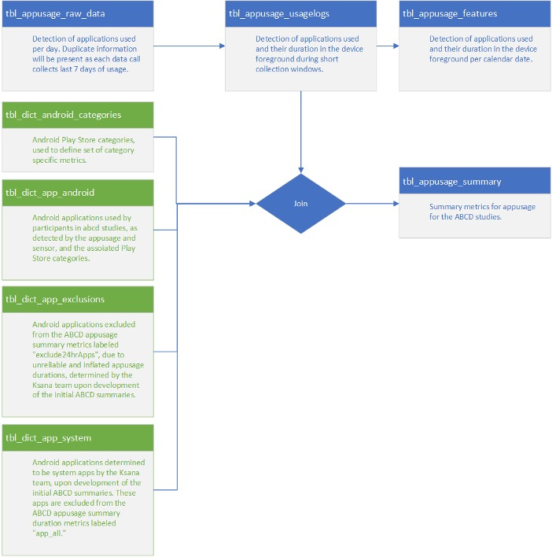
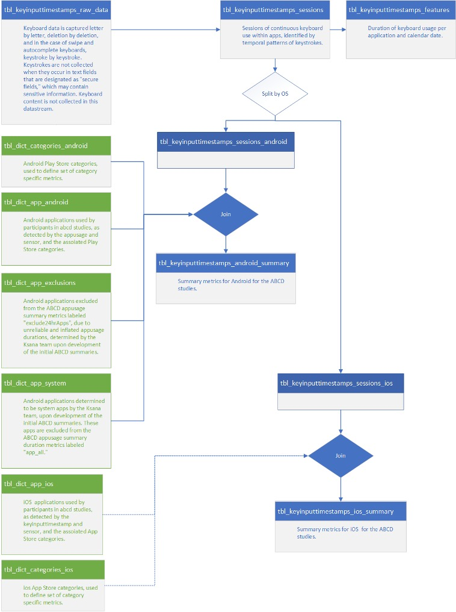

```{r}
#| label: setup
#| include: false 

for (file in list.files("../../../R", full.names = TRUE)) source(file)
```

# Domain overview

```{r}
render_table_info("domain_abbr == 'nt'")
```

<!-- [Download table as a pdf](../../assets/files/documentation/non_imaging/6_1_nt.pdf){style="display: block; text-align: right; margin-top: 4px;"} -->

::: {.callout-important collapse="true" title="Responsible use consideration: Novel Technologies domain general" #use-nt}
Wearable devices, including Fitbit, use optical technology to detect blood volume changes to indicate pulse rate, which is important for the heart rate, sleep, and some of the physical activity output measures derived from Fitbit. Some studies (e.g. @colvonen2020) suggest this is less accurate for darker skin tones and accuracy may be influenced by higher body mass index and tattoos in the location of sensor placement. ABCD collects height and weight, from which BMI can be derived. ABCD does not collect information about skin tone. These potential limitations should be considered.
:::

# Youth tables

## EARS -- Administrative Information {#nt_y_earsadm}

`r table_header("nt_y_earsadm")`

**Measure description:** Administrative table with information on operating system (OS), device type, device version, and data availability for each participant and event from the EARS (Effortless Assessment Research System) [(Ksana Health)](https://ksanahealth.com/ears/) data collection. In instances in which more than one OS, device type, and/or device version was used for the same participant and event, a pipe symbol is used to denote each one. For example, if subject ABCD123 in follow-up year 4 used both an iPhone XR and iPhone 12 during the 21-day data collection, device version is denoted as: iPhone XR \| iPhone 12.

## EARS -- Device Usage Statistics (App Usage) {#nt_y_earsapp}

`r table_header("nt_y_earsapp")`

::: {.callout-caution collapse="true" title="Release notes: `nt_y_ears`"}
**6.0**

-   [**Improved algorithms**](../release_notes/6_0.qmd#ears): For ABCD Release 6.0, Ksana Health reprocessed all participant features using improved algorithms.
:::

**Measure description:** Objective measures of smartphone application use from EARS (Effortless Assessment Research System) [(Ksana Health)](https://ksanahealth.com/ears/), covering total time spent in app categories as selected by app creators (e.g., social, gaming, productivity, communication). The ABCD-EARS app queried the Android UsageStats API every 15 minutes to obtain data on the apps a participant had open in the foreground in the previous 24 hours, including timestamps corresponding to the times at which an app was opened in the foreground and when that app was no longer active in the foreground (for example, when the app was closed or minimized or when a participant shut off their phone screen). While data with accurate timestamps could be held even longer in most phones (e.g., up to or over 24 hours), more frequent querying can allow for even more precise timing.  The Ksana Health team curates this data as it is collected before sending to the ABCD DAIRC, removing known errors (e.g., apps that are known to run for 24 hours; duplicative events) and undergoing further cleaning processes. From there, summary scores (duration, daily average, and weekday vs. weekend totals and averages) are computed from the 3-week sensing period. Pilot study data are not included. In addition to summary score variables released as tabulated data (i.e., where screen use metrics are provided as one value per participant/event), minimally cleaned and processed “raw” and “feature” data from the Effortless Assessment Research System (EARS) with greater temporal resolution and detail are made available as part of the concatenated file-based data (see [here](#ears-file-based)). While the summary score variables have been thoroughly cleaned and underwent arithmetic calculations (e.g., summation), raw and feature EARS data have not undergone such procedures.

**Notes and special considerations:**

iPhone users from release 6.0 onward include only keystroke and screen on/off data, whereas Android users include both app use time and keystroke data. Harmonization methods for Android and iPhone data are discussed in @alexander2023.

In some instances, participants have less or more than 3 weeks (21 days) of data collected; the variable `nt_y_earsapp__day_count` represents the number of days collected. Data users can consider filtering by number of days of data collected. For all files, weekday denotes Monday-Friday and weekend denotes Saturday-Sunday.

Ksana Health provided the following data lineage diagram describing their process for calculating App Usage summary scores:



**Key references:**

- `r full_cite("lind2018")`
- `r full_cite("alexander2023")`

## EARS -- Device Usage Statistics (Keyboard Input) {#nt_y_earskey}

`r table_header("nt_y_earskey")`

::: {.callout-caution collapse="true" title="Release notes: `nt_y_ears`"}
**6.0**

-   [**Improved algorithms**](../release_notes/6_0.qmd#ears): For ABCD Release 6.0, Ksana Health reprocessed all participant features using improved algorithms.
:::

**Measure description:** Objective keystroke measures from EARS (Effortless Assessment Research System) [(Ksana Health)](https://ksanahealth.com/ears/), capturing keystroke count, time from first to last keystroke, and number of keystroke sessions by app. Summary scores are computed from the 3-week sensing period (Monday-Friday counted as weekday; Saturday-Sunday as weekend).

**Modifications since initial administration:** iPhone keyboard data collection ran through 10/19/22, with cessation of keystrokes data collection due to participant burden with the third-party keyboard on iPhones. Beginning 4/10/23, ABCD-EARS resumed collecting iPhone screen on/off data; keystroke data did not resume collection at this time. Future data releases will include iPhone app use information.

Ksana Health provided the following data lineage diagram describing their process for calculating Key Input summary scores:



**Key references:**

- `r full_cite("lind2018")`
- `r full_cite("alexander2023")`

## EARS -- Device Usage Statistics (Pilot) {#nt_y_earsplt}

`r table_header("nt_y_earsplt")`

**Measure description:** Objective screen time and application use data from EARS [(Ksana Health)](https://ksanahealth.com/ears/) for the passive assessment of mobile phone use. These data were collected during a pilot study of methods and compatibility of different software platforms for Device Usage Statistics. Data include measures of time spent in calls and total time spent in various app categories (e.g., YouTube, gaming, productivity, communication), summarized from the 3-week usage period.

**Notes and special considerations:** As a pilot study, these data were collected at a subset of ABCD sites.

**Key reference:** `r full_cite("lind2018")`

## EARS -- Post-Assessment Survey {#nt_y_earsq}

`r table_header("nt_y_earsq")`

**Measure description:** Questionnaire of weekday and weekend time on devices ("screen time") for non-school activities and household rules for device and app usage. Administered following participation in the EARS assessment of device and app usage. To reduce participant burden, administration was stopped mid 6-year follow-up.

## EARS -- Pre/Post-Assessment Survey (Pilot) {#nt_y_earsp}

`r table_header("nt_y_earsp")`

**Measure description:** Pre- and post-questionnaires of weekday and weekend time on devices ("screen time") for non-school activities and household rules for device and app usage. Youth and parents completed independent questionnaires with parents reporting on their youth. These data were collected during a pilot study of methods and compatibility of different software platforms for Device Usage Statistics.

**Notes and special considerations:** These data were collected as pilot data prior to the full study launch of EARS. They were collected at several study sites at Year 2 only on a small number of participants.

## Screen Time Questionnaire {#nt_y_stq data-link="Screen Time Questionnaire"}

`r table_header("nt_y_stq")`

**Measure description:** This measure includes customized questions about the overall amount of time that the youth spends using visual media on a typical weekday and weekend day. Media activities assessed include:

- Watching TV shows or movies
- Watching videos (such as YouTube)
- Playing video games (single- or multiplayer) on a computer, console, phone or other device
- Texting on a cell phone, tablet, or computer
- Visiting social media apps like Snapchat, Instagram, TikTok
- Video chat
- Seven response options were: none, \< 30 minutes, 30 minutes, 1 hour, 2 hours, 3 hours, and 4+ hours.

**Modifications since initial administration:** From the 2-year follow-up on, response options were changed to an open format of number of hours and minutes spent on each screen usage activity. We also included the 6-item social media addiction and video game addiction questionnaires adapted from the Bergen Facebook Addiction Scale [@andreassen2012]. These items are administered only if the youth endorses having at least one social media account or at least some use of video games, respectively. Additionally, we added customized questions about timing of screen usage around bedtime, mobile phone ownership and usage, social media accounts, and online dating. A summary of changes to the youth screen usage questionnaire is contained in the table below.

**Youth Screen Usage Self-Report Questionnaire modifications made by year**

|  |  |  |  |  |  |  |  |  |
|--------|--------|--------|--------|--------|--------|--------|--------|--------|
| **Youth Questions** | **Baseline** | **1** | **2** | **3** | **4** | **5** | **6** | **7** |
| Watch "or stream" TV shows or movies? (such as Hulu, Netflix or Amazon, not including videos on YouTube) | X^a^ | X^a^ | X | X^\#^ | X^\#^ |  |  |  |
| Watch or stream videos or livestream (such as YouTube, Twitch)? | X^b^ | X^b^ | X |  |  |  |  |  |
| Watch or stream movies, videos or TV shows? (such as Hulu, Netflix or Amazon, YouTube, Twitch)? |  |  |  |  |  | X\* | X\* | X\* |
| Play video games on a computer, console, phone or other device (Xbox, PlayStation, iPad)? | X | X |  |  |  |  |  |  |
| Play single-player video games on a computer, console, phone or other digital/mobile technology (e.g. Xbox, PlayStation, iPad, AppleTV)? |  |  | X^e^ | X^e^ | X^e^ | X\* | X\* | X\* |
| Play multiplayer video games on a computer, console, phone, or other digital/mobile technology (e.g. Xbox, PlayStation, iPad, AppleTV) where you can interact with others in the game? |  |  | X^f^ | X^f^ | X^f^ | X\* | X\* | X\* |
| Text on a cell phone, tablet, computer, iPod, or other electronic device (e.g., GChat, WhatsApp, Kik etc.)? | X^c^ | X^c^ | X | X | X | X\* | X\* | X\* |
| Visit social networking sites like Facebook, Twitter, Instagram, etc.? | X | X |  |  |  |  |  |  |
| Visit social media apps (e.g., Snapchat, Facebook, Twitter, Instagram, TikTok, etc.)? (Do not include time spent editing photos or videos to post on social media.) |  |  | X | X | X | X\* | X\* | X\* |
| Edit photos or videos to post on social media. |  |  | X |  |  |  |  |  |
| Video chat (Skype, FaceTime, VRchat, etc.) that is NOT for school | X^d^ | X^d^ | X^g^ | X | X | X\* | X\* | X\* |
| Searching or browsing the internet (e.g., using Google) that is NOT for school. |  |  | X | X |  |  |  |  |
| Spend in TOTAL on a computer, phone, tablet, iPod, or other digital/mobile technology or video game? Please do NOT include time spent on school related work, but do include watching TV, shows or videos, texting or chatting, playing games, or visiting social networking sites (e.g. Facebook, Twitter, Instagram). |  |  | X^h^ | X | X | X | X | X |
| Spend in TOTAL on school-related work on a phone, tablet, computer, or other digital/mobile technology? Please do not include time during school. |  |  | X^i^ |  |  | X | X | X |

Note.

^a^Earlier version read, "Watch TV shows or movies?";

^b^Earlier version read, "Watch videos (such as YouTube)?";

^c^Earlier version read, "Text on a cell phone, tablet, or computer (e.g. GChat, WhatsApp, etc.)?";

^d^Earlier version read, "Video chat (Skype, Facetime, etc.)?";

^e^Earlier version read, "Play single-player video games on a computer, console, phone or other device (Xbox, PlayStation, iPad, AppleTV)?";

^f^Earlier version read, "Play multiplayer video games on a computer, console, phone, or other device (Xbox, PlayStation, iPad, AppleTV) where you can interact with others in the game?";

^g^Earlier version read, "Video chat (Skype, FaceTime, VRchat, etc.)";

^h^Earlier version read, "Spend in TOTAL on a computer, phone, tablet, iPod, or other device or video game? Please do NOT include time spent on school related work, but do include watching TV, shows or videos, texting or chatting, playing games, or visiting social networking sites (Facebook, Twitter, Instagram).";

^i^Earlier version read, "Spend in TOTAL on school-related work on a phone, tablet, computer, or other computerized device? Please do not include time during school."

Includes variables: `nt_y_stq__screen__wkdy__hr_001__01`, `nt_y_stq__screen__wkdy__min_001__01`, 
`nt_y_stq__screen__wknd__hr_001__01`, `nt_y_stq__screen__wknd__min_001__01` (and `_v01` of those variables).

*Asked only for weekend days.

::: {.callout-caution collapse="true" title="Release notes: `nt_y_stq`"}
**6.0** 

-    [**Non-integer value codes**](../release_notes/6_0.qmd#screen-time-questionnaire): There are variables that contain non-integer value codes for categorical levels. These non-integers prevents these variables to be exported to Stata files when exporting data from [DEAP](https://abcd.deapscience.com).
:::

**Key reference:** `r full_cite("andreassen2012")`


## Fitbit -- Pre/Post-Assessment Survey {#nt_y_fitbq}

`r table_header("nt_y_fitbq")`

::: {.callout-note title="File-based Fitbit data"}
In addition to the survey data described below, Fitbit raw and summary score data are released as file-based data. See [Fitbit file-based data](#fitbit-file-based) for documentation on raw activity, raw sleep, and summary scores.
:::

**Measure description:** A customized questionnaire given to youth before and after the youth had worn the Fitbit. This pre-assessment survey established a self-report for youth of "baseline" of activity, sedentary behaviors, and sleep for participants in relation to their peers. The post-assessment survey form allows for comparisons of change from the pre-assessment survey of self-reported youth sedentary behaviors and sleep in relation to peers.

**Notes and special considerations:** Note that the parent and youth items for this measure do not match.

## Fitbit -- Pre/Post-Assessment Survey (Pilot) {#nt_y_fitbp}

`r table_header("nt_y_fitbp")`

::: {.callout-note title="File-based Fitbit data"}
In addition to the survey data described below, Fitbit raw and summary score data are released as file-based data. See [Fitbit file-based data](#fitbit-file-based) for documentation on raw activity, raw sleep, and summary scores.
:::

**Measure description:** A customized questionnaire given to youth before and after the youth had worn the Fitbit during the pilot testing of Fitbit. This pre-assessment survey established a self-report for youth of "baseline" of activity, sedentary behaviors, and sleep for participants in relation to their peers. The post-assessment survey form allows for comparisons of change from the pre-assessment survey of self-reported youth sedentary behaviors and sleep in relation to peers.

**Notes and special considerations:** As a pilot study, these data were collected at a subset of ABCD sites.

**Key reference:** `r full_cite("starkey2014")`

# Parent tables

## EARS --- Parent Post-Assessment Survey {#nt_p_earsq}

`r table_header("nt_p_earsq")`

**Measure description:** Parent-reported questionnaire of youth weekday and weekend time on devices ("screen time") for non-school activities and household rules for device and app usage. Youth and parents completed independent questionnaires, with parents reporting on their youth (see the [Youth Post-Assessment Survey](#nt_y_earsq)). These instruments were collected following participation in the EARS assessment of device and app usage.

## EARS --- Parent Pre/Post-Assessment Survey (Pilot) {#nt_p_earsp}

`r table_header("nt_p_earsp")`

**Measure description:** Pre- and post-questionnaires of weekday and weekend time on devices (e.g., "screen time") for non-school activities and household rules for device and app usage. Youth and parents completed independent questionnaires with parents reporting on their youth. These data were collected during a pilot study of methods and compatibility of different software platforms for Device Usage Statistics. These data were only collected at the Year 2 Follow-Up at select study sites.

**Notes and special considerations:** These data were collected as pilot data prior to the full study launch of EARS. They were collected at several study sites at Year 2 only on a small number of participants.

## Parent Screen Time Questionnaire {#nt_p_stq}

`r table_header("nt_p_stq")`

**Measure description:** This is a parent self-report of screentime behaviors and behavior modeling. The parent is asked about the amount of time that they themselves spend using various forms of visual media, on weekdays and weekends. Questions about screentime behavior modeling are from Tang et al. (2018).

**Key reference:** `r full_cite("tang2018")`

## Screen Time Questionnaire on Youth {#nt_p_yst}

`r table_header("nt_p_yst")`

**Measure description:** This parent-reported measure evaluates the overall amount of time that the youth spends using visual media (e.g. cellphone, iPad, videos), on a typical weekday and weekend day, not including time spent on school-related work.

**Modifications since initial administration:** From 2-year follow-up, parents also answered questions about their experiences with their child's media use. The question "Does your child have their own device" is discontinued in Year 4; use the item "Do you have your own mobile phone?" from the youth self-report Screen Time Questionnaire for years 4 onwards.

**Key reference:** `r full_cite("bagot2018")`

## Fitbit --- Parent Pre/Post-Assessment Survey {#nt_p_fitbq}

`r table_header("nt_p_fitbq")`

::: {.callout-note title="File-based Fitbit data"}
In addition to the survey data described below, Fitbit raw and summary score data are released as file-based data. See [Fitbit file-based data](#fitbit-file-based) for documentation on raw activity, raw sleep, and summary scores.
:::

**Measure description:** A customized questionnaire given before and after the youth had worn the Fitbit. This pre-assessment survey established a parent-report for youth of "baseline" of activity, sedentary behaviors, and sleep for participants in relation to their peers. The post-assessment survey form allows for comparisons of change from the pre-assessment survey of parent-reported for youth, sedentary behaviors, and sleep for participants in relation to their peers.

## Fitbit --- Parent Pre/Post-Assessment Survey (Pilot) {#nt_p_fitbp}

`r table_header("nt_p_fitbp")`

::: {.callout-note title="File-based Fitbit data"}
In addition to the survey data described below, Fitbit raw and summary score data are released as file-based data. See [Fitbit file-based data](#fitbit-file-based) for documentation on raw activity, raw sleep, and summary scores.
:::

**Measure description:** A customized questionnaire given to parents (Parent Measure) before and after the youth had worn the Fitbit during the pilot testing of Fitbit. This pre-assessment survey established a parent-report for youth of "baseline" of activity, sedentary behaviors, and sleep for participants in relation to their peers. The post-assessment survey form allows for comparisons of change from the pre-assessment survey of parent-reported for youth, sedentary behaviors, and sleep for participants in relation to their peers.

**Notes and special considerations:** As a pilot study, these data were collected at a subset of ABCD sites.

# File-based data

## Fitbit {#fitbit-file-based}

`r table_header(tabulated = FALSE, file_based = TRUE, concatenated = TRUE)`

```default
abcd
└── concatenated
    └── novel_technologies
        └── fitbit
            ├── fitbit_covid_raw_activity.<csv|parquet>
            ├── fitbit_covid_raw_metrics.<csv|parquet>
            ├── fitbit_covid_raw_sleep_30.<csv|parquet>
            ├── fitbit_covid_raw_sleep_60.<csv|parquet>
            ├── fitbit_covid_raw_sleep.<csv|parquet>
            ├── fitbit_covid_ss_activity_day.<csv|parquet>
            ├── fitbit_covid_ss_activity_day_ext.<csv|parquet>
            ├── fitbit_covid_ss_activity_week.<csv|parquet>
            ├── fitbit_covid_ss_activity_week_ext.<csv|parquet>
            ├── fitbit_covid_ss_sleep_day.<csv|parquet>
            ├── fitbit_covid_ss_sleep_day_ext.<csv|parquet>
            ├── fitbit_covid_ss_sleep_week.<csv|parquet>
            ├── fitbit_covid_ss_sleep_week_ext.<csv|parquet>
            ├── fitbit_raw_activity.<csv|parquet>
            ├── fitbit_raw_metrics.<csv|parquet>
            ├── fitbit_raw_sleep_30.<csv|parquet>
            ├── fitbit_raw_sleep_60.<csv|parquet>
            ├── fitbit_raw_sleep.<csv|parquet>
            ├── fitbit_ss_activity_day.<csv|parquet>
            ├── fitbit_ss_activity_day_ext.<csv|parquet>
            ├── fitbit_ss_activity_week.<csv|parquet>
            ├── fitbit_ss_activity_week_ext.<csv|parquet>
            ├── fitbit_ss_sleep_day.<csv|parquet>
            ├── fitbit_ss_sleep_day_ext.<csv|parquet>
            ├── fitbit_ss_sleep_week.<csv|parquet>
            └── fitbit_ss_sleep_week_ext.<csv|parquet>
```

### File details

```{r fitbit_tbl}
library(reactable)
fitbit_tbl <- read.csv("../../assets/tbl/documentation/non_imaging/fitbit_file.csv")
fitbit_tbl %>%
reactable(columns = list(
`filename` = colDef(width = 250, cell = function(value) tags$code(value)))
)
```

::: {.callout-note title="File formats"}
The Fitbit file-based data are made available as both `csv` and `parquet` files to support a range of tools and user preferences. However, since the `parquet` format ensures that data is imported with correctly specified data types and facilitates faster loading speeds, we recommend using `parquet` files over `csv` files whenever possible (see [here](../curation/structure.qmd#file-formats)).
:::

### Overview

Fitbit wearable device data were collected across multiple follow-up waves of the study and processed into analysis-ready daily and weekly summary datasets. Raw device data encompass sleep staging, heart rate, steps, and activity intensity. Processing steps included harmonization of epoch-level sleep data across waves, heart rate–based quality control, and exclusion of invalid minutes prior to score computation. Summary scores are provided at the daily and weekly level for both activity and sleep data, with a standard and extended scoring framework available for each.

For the 2-year and 4-year follow-up waves, Fitbit data were extracted using Fitabase. For the 6-year follow-up wave and later data collections, Fitbit data were accessed using an ABCD custom API. This transition allowed for more efficient, direct, and flexible retrieval of participant-level data.

To download these raw data, follow the instructions on the ['Access & Download' page](../../usage/access.qmd).

### Data processing

Fitbit data were processed through wave-specific pipelines due to differences in raw data structure. Earlier waves (2- and 4-year) provided sleep data at a fixed 30-second epoch resolution, whereas later waves (6- and 8-year) provided sleep data as stage-based intervals with associated durations. To harmonize these formats, stage-based records were expanded into uniform 30-second and 60-second epochs prior to downstream computation. In cases where stage-based records were provided only in 30-second staging classifications, stages were recoded into 60-second staging for the 60-second sleep raw dataset:

| 30-second stage | 60-second stage |
| --- | --- |
| wake | awake |
| light | asleep |
| rem | asleep |
| deep | asleep |

Each pipeline incorporated steps to remove duplicate records. When duplicate epochs were present across sources, a single record was retained according to a predefined stage hierarchy. In earlier waves, deduplication was performed by retaining the record with the most recent metadata. In later waves, sleep data were de-duplicated at the epoch level based on sleep stage, with priority given to the most wake-like state.

For 30-second epoch data, the retention priority was:

- wake > light > rem > deep

For 60-second epoch data, the retention priority was:

- awake > restless > asleep

For sleep data, main sleep epochs were identified through linkage with sleep log records, which indicate whether a given sleep sequence is classified as "main sleep." Main sleep refers to the primary sleep period within a 24-hour day, typically representing the longest continuous sleep episode (e.g., overnight sleep), as opposed to shorter naps or secondary sleep periods.

The pipeline drew from four source inputs: fitbit_raw_sleep_30 (30-second sleep epochs), fitbit_raw_sleep_60 (60-second sleep epochs), fitbit_raw_activity (heart rate, steps, METs, and intensity at 1-minute resolution), and fitbit_raw_metrics (daily-level measures generated by Fitbit). Activity data were joined to sleep data at the minute level to flag whether each minute is associated with sleep (is_slp) and main sleep (main_slp).

The two sleep epoch files were harmonized into a single released dataset (fitbit_raw_sleep) to maximize temporal coverage, since the 30-second and 60-second datasets do not fully overlap. The 60-second epoch data were expanded to 30-second resolution and merged with the 30-second epoch dataset, with duplicate epochs resolved by preferentially retaining 30-second records. Heart rate, recorded at 60-second resolution, was appended to each 30-second sleep epoch by mapping to the corresponding base-minute timestamp (i.e., :00).

### Raw data

::: {.callout-caution collapse="true" title="Release notes: `Fitbit raw data`"}
**7.0**

-   [**Raw data files**](../release_notes/7_0.qmd#fitbit-raw-data-files): The known issues from 6.0 have been fixed for the 7.0 Release.
    The qc_300min quality control flag in the sleep daily output was computed using min_total_slp > 299 rather than min_total_slp >= 300. Because min_total_slp is a floating-point value, the > 299 condition passes any value strictly greater than 299, meaning days with fewer than 300 valid sleep minutes (e.g., 299.5) may incorrectly pass QC. Users relying on this flag to enforce a 300-minute minimum should be aware that affected records may be present in their data.

    Sleep daily and weekly summary outputs were not filtered to exclude pre-session records which can be identified by day = 0 and wk = 0. Users should apply filter(day != 0) before using daily data and apply filter(wk != 0) before using corresponding weekly summaries.

    Records in fitbit_raw_metrics belonging to `session_id` ses-08A were incorrectly labeled with `session_id = 08A`.


**6.0**

-   [**Raw data errors**](../release_notes/6_0.qmd#fitbit-raw-data-files)
:::

#### Activity

Activity raw data are released in two files: `fitbit_raw_activity` (heart rate, steps, METs, and intensity at 1-minute resolution) and `fitbit_raw_metrics` (daily-level metrics generated by Fitbit, such as resting heart rate, steps, and intensity-level minutes). COVID substudy equivalents are released as `fitbit_covid_raw_activity` and `fitbit_covid_raw_metrics`.

The metadata for the activity raw data files are detailed below (the metadata for the COVID substudy files are the same):

#### Sleep

Sleep raw data are released in three files: `fitbit_raw_sleep_30` (30-second epochs), `fitbit_raw_sleep_60` (60-second epochs), and `fitbit_raw_sleep` (the harmonized combined sleep dataset transformed to 30-second resolution, used as the input for sleep summary scores). COVID substudy equivalents are released as `fitbit_covid_raw_sleep_30`, `fitbit_covid_raw_sleep_60`, and `fitbit_covid_raw_sleep`.

::: {.callout-note title="Short sleep periods (6-year follow-up onward)"}
Starting with the 6-year follow-up, the ABCD team began receiving data directly through the Fitbit API. This resulted in additional sleep data being acquired for sleep periods of less than 3 hours. These data are not staged into deep, REM, and light sleep categories. They have been included in the raw data in the current release, but not in the daily (or weekly) level aggregated data.
:::

#### Metadata information

The metadata (data dictionary and categorical levels tables) for the Fitbit raw data files are provided below (the metadata for the COVID substudy version of the files are the same; as such, the metadata is only provided for the main study version).

The data dictionary provides detailed information about the variables included in each file, including variable names, labels, and data types; the categorical levels table provides the mapping between values provided in the data and corresponding labels for categorical variables. Users are encouraged to consult the metadata to understand the structure and content of the data before working with it. Select the table of interest and switch between the `Data Dictionary` and `Categorical Levels` tabs.

```{r}
#| results: asis
#| echo: false
make_nested_tabsets(
  c(
    "fitbit_raw_activity",
    "fitbit_raw_metrics",
    "fitbit_raw_sleep_30",
    "fitbit_raw_sleep_60",
    "fitbit_raw_sleep"
  ),
  base_path = "../../assets/tbl/documentation/non_imaging/"
)
```

### Summary scores

::: {.callout-caution collapse="true" title="Release notes: `Fitbit summary scores`"}
**7.0**

-   [**Summary scores**](../release_notes/7_0.qmd#fitbit-summary-scores): Fitbit summary scores have been included in the 7.0 Release.

**6.0**

-   [**Summary scores**](../release_notes/6_0.qmd#fitbit-summary-scores)
:::

Daily and weekly activity and sleep summary scores are derived from Fitbit wearable device data, with score calculations and analytical approaches based on findings and suggestions from Wing et al (2022).  Activity scores are constructed from 60-second epoch data using inputs such as step counts, metabolic equivalents (METs), categorical intensity, and heart rate, and are aggregated using only valid minutes. Sleep scores draw from a harmonized dataset combining 30-second and 60-second epoch data, with a focus on main sleep periods while separately accounting for nap episodes. Both activity and sleep scoring frameworks apply event-based restrictions for standard and COVID substudy datasets, and include quality indicators to flag potentially artifactual or incomplete data. An extended summary scoring framework is also described, in which sleep episodes are consolidated using a 90-minute proximity rule to capture unified sleep sequences across periods separated by brief waking intervals.

**Valid minutes**

Valid minutes were defined as observations that met predefined data quality criteria, including (1) heart rate values above a specified physiological threshold (≥ 50), (2) non-missing heart rate, and (3) non-repetitive heart rate. Minutes that did not meet these criteria were classified as invalid and excluded from all downstream aggregation. Summaries of excluded minutes, including the reasons for exclusion, are calculated and provided.

Repeated minutes were identified based on extended sequences of identical values within a continuous time sequence. Specifically, repetition was defined as ≥ 10 consecutive minutes with identical observations during non-sleep periods or ≥ 30 consecutive minutes with identical observations during sleep periods.

When a minute meets more than one exclusion criterion simultaneously, a single mutually exclusive flag is assigned according to a predefined priority order. Repeated heart rate takes highest priority over low heart rate values. For example, a minute where heart rate is both below the specified threshold and part of a repeated sequence will be classified as repeated rather than low. This priority hierarchy ensures that exclusion counts across categories are non-overlapping and sum cleanly to the total number of excluded minutes.

Sequences of missing heart rate values that were bounded on both sides by the same observed value were treated as part of the repeated sequence. If the combined sequence (including the intervening missing values) met the repetition threshold, all minutes in the sequence were classified as repeated and excluded (examples 1 and 2). Otherwise, the missing minutes were retained and treated as missing (example 3):

::: {.callout-note collapse="true" title="Example 1"}
Missing heart rate values are bounded by identical values, resulting in a sequence of 20 repetitive values, which would be excluded from scoring:

| dtt | hrate |
| --- | --- |
| 2019-06-16 13:01:00 | 86 |
| 2019-06-16 13:02:00 | 86 |
| 2019-06-16 13:03:00 | 86 |
| 2019-06-16 13:04:00 | 86 |
| 2019-06-16 13:05:00 | NA |
| 2019-06-16 13:06:00 | NA |
| 2019-06-16 13:07:00 | NA |
| 2019-06-16 13:08:00 | NA |
| 2019-06-16 13:09:00 | 86 |
| 2019-06-16 13:10:00 | 86 |
| 2019-06-16 13:11:00 | NA |
| 2019-06-16 13:12:00 | NA |
| 2019-06-16 13:13:00 | NA |
| 2019-06-16 13:14:00 | 86 |
| 2019-06-16 13:15:00 | 86 |
| 2019-06-16 13:16:00 | 86 |
| 2019-06-16 13:17:00 | 86 |
| 2019-06-16 13:18:00 | 86 |
| 2019-06-16 13:19:00 | 86 |
| 2019-06-16 13:20:00 | 86 |
:::

::: {.callout-note collapse="true" title="Example 2"}
Similar to example 1, the following pattern is interpreted as 11 repetitive heart rate values and excluded from scoring:

| dtt | hrate |
| --- | --- |
| 2019-06-16 13:01:00 | 86 |
| 2019-06-16 13:02:00 | NA |
| 2019-06-16 13:03:00 | NA |
| 2019-06-16 13:04:00 | NA |
| 2019-06-16 13:05:00 | NA |
| 2019-06-16 13:06:00 | NA |
| 2019-06-16 13:07:00 | NA |
| 2019-06-16 13:08:00 | NA |
| 2019-06-16 13:09:00 | NA |
| 2019-06-16 13:10:00 | NA |
| 2019-06-16 13:11:00 | 86 |
:::

::: {.callout-note collapse="true" title="Example 3"}
Like in examples 1 and 2, the sequence of three consecutive missing values is also bounded by identical values. However, the repetitive sequence does not meet the threshold length (10+ consecutive values for non-sleep), and 5 rows would be excluded due to missing values:

| dtt | hrate |
| --- | --- |
| 2019-06-16 13:01:00 | 86 |
| 2019-06-16 13:02:00 | NA |
| 2019-06-16 13:03:00 | NA |
| 2019-06-16 13:04:00 | NA |
| 2019-06-16 13:05:00 | 86 |
| 2019-06-16 13:06:00 | NA |
| 2019-06-16 13:07:00 | 87 |
| 2019-06-16 13:08:00 | 88 |
| 2019-06-16 13:09:00 | 87 |
| 2019-06-16 13:10:00 | 86 |
| 2019-06-16 13:11:00 | 87 |
| 2019-06-16 13:12:00 | 88 |
| 2019-06-16 13:13:00 | 88 |
| 2019-06-16 13:14:00 | 88 |
| 2019-06-16 13:15:00 | NA |
:::

#### Activity

Activity scores were derived from 60-second epoch activity data and aggregated to the daily level using valid minutes only. Activity inputs included step counts, categorical intensity, METs, and heart rate. For event-based data (`fitbit_ss_activity_day`, `fitbit_ss_activity_day_ext`), daily activity scores were restricted to the first 21 days following device issuance. For COVID substudy datasets (`fitbit_covid_ss_activity_day`, `fitbit_covid_ss_activity_day_ext`), scores were calculated on available data collected during the participant's 2-year event.

Activity scores are computed for all recorded minutes (`_total`) and separately for non-sleep minutes (`_actv`). In the latter case, activity is summarized after excluding minutes classified as sleep.

**Weekly activity scores**

Daily activity scores were included in weekly summary calculations only if the corresponding day contained at least 600 valid non-sleep minutes (i.e., minutes not excluded due to heart rate–based quality criteria). In addition, days were included only if the total step count was at least 80% of the step count reported in Fitbit's native daily metrics. Weekly activity summary scores are released in `fitbit_ss_activity_week` and `fitbit_ss_activity_week_ext`, with COVID substudy equivalents in `fitbit_covid_ss_activity_week` and `fitbit_covid_ss_activity_week_ext`.

#### Sleep

Sleep scores are generated based on the combined sleep dataset, which harmonizes the 30-second and 60-second epoch sleep data. Sleep scores are calculated based on main sleep (`main_slp`) minutes. Minutes not classified as main sleep are identified as nap periods, and sleep-related metrics are calculated separately for these periods where applicable. For event-based data (`fitbit_ss_sleep_day`, `fitbit_ss_sleep_day_ext`), daily sleep scores were restricted to the first 21 nights following device issuance. This includes sleep data collected on the date of issuance, beginning at the time the device was issued. For COVID substudy datasets (`fitbit_covid_ss_sleep_day`, `fitbit_covid_ss_sleep_day_ext`), scores were calculated on available data collected during the participant's 2-year event.

**Implausible sleep structure**

Sleep scores include an indicator flagging potentially corrupted or artifactual sleep sessions. When a valid sleep block is immediately followed by a sustained heart rate dropout (≥ 30 minutes), the session is flagged via `flg_slp`. This pattern is consistent with device removal or displacement at wake-up, rendering the preceding sleep epoch unreliable. Flagged sessions are retained in downstream weekly score calculations but serve as a quality indicator for data users.

**Potentially recoverable sleep minutes**

Sleep scores include a variable, `min_extra_nohrate_slp`, capturing sleep minutes that were excluded due to missing heart rate data occurring before midnight. Rather than reflecting a true HR dropout, this pattern is more consistent with a device syncing error, where data fails to transfer correctly rather than being absent at collection. The flagged minutes represent potentially valid sleep that are excluded from daily and weekly score calculations.

**Extended summary scores**

A separate scoring framework is used to derive an additional set of sleep summary measures. In this framework, sleep episodes are consolidated using a 90-minute proximity rule, such that any sleep periods occurring within 90 minutes of one another are merged into a single continuous sleep episode.

Before episode construction, sleep minutes are evaluated following the exclusion of invalid epochs. Sleep is reclassified after determining and removing invalid minutes to ensure that episode construction is based only on valid data.

This process treats short wake gaps between sleep periods as part of a unified sleep sequence. As a result, epochs previously classified as non-sleep within these gaps are reclassified as part of the same sleep episode and assigned wake as the sleep stage. If any portion of the sleep sequence was originally classified as main sleep, the entire unified sleep sequence is classified as main sleep.

Following episode reconstruction, exclusion rules are re-applied to ensure consistency with the reclassified sleep structure. Summary scores are calculated as described previously, based on reclassification of data into sleep and non-sleep states, with sleep start and end times adjusted to reflect the consolidated episode boundaries. When more than one main sleep block is identified, or when a sleep episode exceeds 180 minutes in duration, standard summary scoring procedures are not applied.

**Weekly sleep scores**

Day-level sleep scores were included in weekly summary calculations if the corresponding date contained at least 300 valid sleep minutes. Weekly sleep summary scores are released in `fitbit_ss_sleep_week` and `fitbit_ss_sleep_week_ext`, with COVID substudy equivalents in `fitbit_covid_ss_sleep_week` and `fitbit_covid_ss_sleep_week_ext`.

**Circular mean**

Timing variables (e.g., `mean_t_start_bed`, `mean_t_end_slp`) were summarized using the circular mean, as these data are on a 24-hour cycle. The circular mean treats time as angular data through which average times can be calculated (@klerman2017):

θ̄ = atan2( 1/n Σ sin θᵢ , 1/n Σ cos θᵢ )

#### Metadata information

The metadata (data dictionary and categorical levels tables) for the Fitbit summary score files are provided below (the metadata for the COVID substudy as well as the extended versions of the files are the same; as such, the metadata is only provided for the main study version in the standard version).

The data dictionary provides detailed information about the variables included in each file, including variable names, labels, and data types; the categorical levels table provides the mapping between values provided in the data and corresponding labels for categorical variables. Users are encouraged to consult the metadata to understand the structure and content of the data before working with it. Select the table of interest and switch between the `Data Dictionary` and `Categorical Levels` tabs.

```{r}
#| results: asis
#| echo: false
make_nested_tabsets(
  c(
    "fitbit_ss_activity_day",
    "fitbit_ss_activity_week",
    "fitbit_ss_sleep_day",
    "fitbit_ss_sleep_week"
  ),
  base_path = "../../assets/tbl/documentation/non_imaging/"
)
```

## EARS {#ears-file-based}

`r table_header(tabulated = FALSE, file_based = TRUE, concatenated = TRUE)`

```default
abcd
└── concatenated
    └── novel_technologies
        └── ears
            ├── ears_appusage_dt.<csv|parquet>
            ├── ears_appusage_logs.<csv|parquet>
            ├── ears_appusage_raw.<csv|parquet>
            ├── ears_appusage2_dt.<csv|parquet>
            ├── ears_appusage2_logs.<csv|parquet>
            ├── ears_appusage2_raw.<csv|parquet>
            ├── ears_keyinput_dt.<csv|parquet>
            ├── ears_keyinput_raw.<csv|parquet>
            ├── ears_keyinput_sess.<csv|parquet>
            ├── ears_notification_raw.<csv|parquet>
            ├── ears_screenon_dt.<csv|parquet>
            ├── ears_screenon_hr.<csv|parquet>
            ├── ears_screenon_raw.<csv|parquet>
            ├── ears_stappusage_raw.<csv|parquet>
            └── ears_stdevusage_raw.<csv|parquet>
```

In addition to summary score variables released as tabulated data (i.e., where screen use metrics are provided as one value per participant/event, see [here](nt.qmd#effortless-assessment-research-system-ears)), minimally cleaned and processed "raw" and "feature" data from the Effortless Assessment Research System (EARS) with greater temporal resolution and detail are made available as part of the concatenated file-based data. While the summary score variables have been thoroughly cleaned and underwent arithmetic calculations (e.g., summation), raw and feature EARS data have not undergone such procedures.

These data offer greater flexibility for users to generate their own summary scores and to explore the data in more depth, but they also require more careful handling and understanding of the data structure and content. The following sections provide an overview of the different sensor types, file types, and special considerations for working with EARS raw and feature data.

::: {.callout-note title="File formats"}
The EARS raw and feature data are made available as both `csv` and `parquet` files to support a range of tools and user preferences. However, since the `parquet` format ensures that data is imported with correctly specified data types and facilitates faster loading speeds, we recommend using `parquet` files over `csv` files whenever possible (see [here](../curation/structure.qmd#file-formats)).
:::

### Sensor types

EARS provides raw and feature data for the following sensor types:

- **appusage:** This sensor which is only available on Android phones uses internal Android APIs to track application usage over the course of the day. The older version of this sensor queries the application usage in overlapping collection windows, always querying the last 7 days of usage.
- **appusage2:** This sensor which is only available on Android phones uses internal Android APIs to track application usage over the course of the day. The newer version of this sensor (only available for data from August 2024 onwards) provides an exact time series of application usage events.
- **keyinput:** This sensor which was available for both Android and iOS phones used key input events, i.e., the use of the phone's keyboard, to infer application usage and other metrics over the course of the day. The sensor was retired in August 2023, i.e., only data collected before that date include this sensor.
- **notification:** This sensor which is only available for Android phones provides information about notification events that occurred on the participant's phone over the course of the day, including the app that generated the notification, the time of the notification, and whether the notification was interacted with.
- **screenon:** This sensor, originally only available for iOS phones tracks screen on/off events over the course of the day as a proxy for overall device usage. Starting in August 2024, this sensor also includes data from Android phones, which are derived from the `appusage2` sensor.
- **stappusage:** This sensor which is only available for iOS phones tracks application usage duration per day. Users take daily screenshots of their iOS Screen Time reports which are scraped using optical character recognition (OCR) and processed to generate daily-level application usage data.
- **stdevusage:** This sensor which is only available for iOS phones tracks device usage duration per day. Users take daily screenshots of their iOS Screen Time reports which are scraped using optical character recognition (OCR) and processed to generate daily-level device usage data.

The following gives an overview of the different sensor types, the OS and time ranges they are available for, as well as whether they provide raw and/or feature data:

```{r}
render_table_with_icons(
  csv = "../../assets/tbl/documentation/non_imaging/ears_types.csv",
  widths = list(
    Sensor = 150,
    Description = 300
  )
)
```

### File types and processing

For all sensors, data are provided as "raw" data, i.e., in the format in which they were originally collected. For some sensors, "feature" data are provided in addition. These data have been further processed to be more easily usable and interpretable, e.g., aggregated to hour or day level information. We generally recommend working with the feature data where available but, depending on the research question, working with the raw data may be preferred.

The DAIRC minimally processes the original data received from Ksana Health, the company that collects EARS data, to make it more usable for researchers. The processing steps include:

- Create `participant_id` and `session_id` columns in the release format.
- Convert timestamps from UNIX timestamps into the more commonly used `YYYY-MM-DD HH:MM:SS` format.
- Where appropriate and not already present, add a `dt` column *to allow for aggregation by date*.
- For files with a `dt` column,
  - add `dt_day` (day of the week) column *to allow for aggregation by day of the week*.
  - add `dt_wknd` column (`TRUE` if `dt_day` is "Sat" or "Sun") *to allow for aggregation by weekend vs. week day*.
- If `app` column is present, add `category` column that uses categories from the respective OS' app store *to allow for aggregation by app category (e.g., "social", etc.)*; see app category tables for Android and iOS below.
- If table is including data from both OSes, add an `os` column ("andr" vs. "ios") *to allow to take those into account for aggregation*

The following gives an overview of the different file types, their content, temporal resolution, file sizes, and memory consumption when loaded using a statistical programming language like R or Python:

```{r}
render_table_with_icons(
  csv = "../../assets/tbl/documentation/non_imaging/ears_files.csv",
  widths = list(
    `File name` = 220,
    Description = 300
  ),
  pagination = FALSE
)
```

### Metadata information

The metadata (data dictionary and categorical levels tables) for each of the EARS raw and feature data files are provided below. The data dictionary provides detailed information about the variables included in each file, including variable names, labels, and data types; the categorical levels table provides the mapping between values provided in the data and corresponding labels for categorical variables. Users are encouraged to consult the metadata to understand the structure and content of the data before working with it. Select the table of interest and switch between the `Data Dictionary` and `Categorical Levels` tabs.

```{r}
#| results: asis
#| echo: false
make_nested_tabsets(
  c(
    "ears_appusage_raw",
    "ears_appusage_dt",
    "ears_appusage_logs",
    "ears_appusage2_raw",
    "ears_appusage2_dt",
    "ears_appusage2_logs",
    "ears_keyinput_raw",
    "ears_keyinput_dt",
    "ears_keyinput_sess",
    "ears_notification_raw",
    "ears_screenon_raw",
    "ears_screenon_dt",
    "ears_screenon_hr",
    "ears_stappusage_raw",
    "ears_stdevusage_raw"
  ),
  base_path = "../../assets/tbl/documentation/non_imaging/"
)
```

Ksana Health provides mapping tables that between the application IDs reported in the data and categories in the respective OS' app store (iOS App Store / Google Play Store). These tables are used to assign categories to all files that contain application IDs by adding a `category` column as part of the DAIRC processing pipeline for the EARS data. The categories for iOS and Android are provided below as well as a mapping table that assigns common categories (column `category_abcd`) across OSes that users can use to join with the data for cross-OS comparisons [see @alexander2023].

::: {.panel-tabset}
# iOS app categories

```{r}
reactable::reactable(
  readr::read_csv(
    "../../assets/tbl/documentation/non_imaging/ears_categ_ios.csv",
    show_col_types = FALSE
  )
)
```

# Android app categories

```{r}
reactable::reactable(
  readr::read_csv(
    "../../assets/tbl/documentation/non_imaging/ears_categ_andr.csv",
    show_col_types = FALSE
  )
)
```

# Combined app categories

```{r}
reactable::reactable(
  readr::read_csv(
    "../../assets/tbl/documentation/non_imaging/ears_categ_combined.csv",
    show_col_types = FALSE
  )
)
```
:::

### Tips and special considerations for working with EARS file-based data

1. Some of the files are comparatively large and need sufficient resources to be loaded into memory in entirety (see files table above for the estimated memory usage for loading different files). For users who work on systems with limited resources, we recommend using tools that allow for loading and processing data in chunks or use a database backend.
1. While the data EARS data collection period is planned to last 21 consecutive days, some participants provide usable data for less than 21 days. Users are encouraged to consider the duration of data collection when aggregating across all available days; below code snippets provide example code for how to identify days or whole participant/events to exclude because of insufficient information.
1. In some rare cases, participants switched between iOS and Android devices during a participant/event. This is generally not encouraged but happened seldomly. For most raw/feature data, this is not a problem because they are OS-specific, i.e., participants' data would show up in one or the other, but only for part of the days they contributed. For tables that have data from both OSes, we added an `os` column that indicates the OS per row; users can use that column if they want to differentiate them within or between participants or want to filter out participant/events that have partial data from both OSes.
  
### Code examples

::: {.panel-tabset}

# <i class="fa-brands fa-r-project"></i> Computing summaries

```{r}
#| eval: false
#| echo: true
library(dplyr)

# read in data
appusage2_logs <- arrow::read_parquet("path/to/ears_appusage2_logs.parquet")

# compute screen time by day (reproducing day-level aggregate data)
appusage2_logs |>
  summarize(
    sec_foreground = sum(sec_foreground, na.rm = TRUE),
    .by = c(participant_id, session_id, dt, app)
  )

# compute screen time by week day vs. weekend day
appusage2_logs |>
  summarize(
    sec_foreground = sum(sec_foreground, na.rm = TRUE),
    .by = c(participant_id, session_id, dt_wknd)
  )

# compute screen time time by app category
appusage2_logs |>
  summarize(
    sec_foreground = sum(sec_foreground, na.rm = TRUE),
    .by = c(participant_id, session_id, category)
  )

# compute screen time by app category and week day vs. weekend day
appusage2_logs |>
  summarize(
    sec_foreground = sum(sec_foreground, na.rm = TRUE),
    .by = c(participant_id, session_id, dt_wknd, category)
  )
```

# <i class="fa-brands fa-r-project"></i> QC/filter data

```{r}
#| eval: false
#| echo: true

library(dplyr)

appusage2_logs <- arrow::read_parquet("path/to/ears_appusage2_logs.parquet")
```
:::
